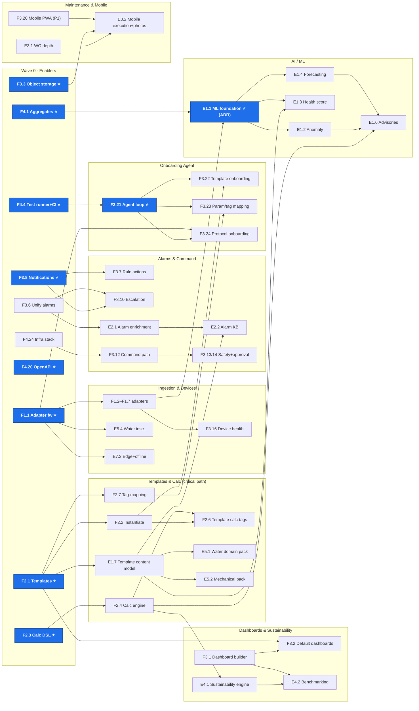

# TRINETRA / Enterprise EMS — Unified Pending-Feature Backlog

**This is the single managed backlog.** All pending scope — the original
north-star/client delta (`F` ids) and the Ion Exchange EMS SOW delta (`E` ids)
— lives here, with sequencing, dependencies, and live status. Update THIS file;
the source analyses are archived under [archive/](./archive/).

**Maintained by:** the human/AI team, every build cycle.
**Execution playbook:** [build-operating-model.md](./build-operating-model.md)
(per-feature loop, subagent fan-out rules, worktree isolation).
**Scope law:** nothing below is active scope until it has an ADR
(AGENTS.md §10); new dependencies are §9.4-gated. On promotion, mirror the item
into [roadmap.md](./roadmap.md).

---

## How to use this document

- **Status** column is the live tracker: `⬜ pending` · `🟡 ADR/planned` ·
  `🔵 in progress` · `✅ done` · `⛔ dropped`. Update it as part of each cycle's
  final commit.
- **Wave** = execution order layer (0 first). Items in the same wave are
  parallel-safe unless *Depends* says otherwise. Never start an item whose
  *Depends* entries aren't ✅.
- **⭐ enabler** = build serially, hands-on, never via cold subagent
  (operating model §3).
- **P** = priority (P0 blocks client MVP … P3 low). Effort in person-weeks,
  planning-grade.
- Adding scope? Append a row with the next free id (`F`/`E` per origin), set
  Wave by its dependencies, and note the source. Removing scope? Mark `⛔`,
  don't delete — provenance matters.

**Sources (archived, read-only):**
[pending-features](./archive/pending-features.md) ·
[sequencing](./archive/pending-features-sequencing.md) ·
[SOW delta](./archive/sow-ems-pending-features.md) ·
plus the assessment docs and `AGENTS.production.md` referenced therein.

---

## 1. Wave plan at a glance

```
WAVE 0  enablers+quick wins: F4.4⭐ F1.1⭐ F2.1⭐ F2.3⭐ F3.8⭐ F4.1/4.2⭐ F4.20⭐ F3.3⭐
        F4.11 F4.12 F3.6 F1.8 F1.9 F4.24 E8.1 E8.2 + ADRs(E1.1, E7.1, positioning)
WAVE 1  F1.2 F1.3 F1.4 F1.5 F1.6 F1.7 F1.10  F2.2 F2.4  F3.7 F3.10 F3.1 F3.4 F3.11
        F4.5 F4.7 F4.8 F4.10 F4.14 F4.23  E1.7 E3.1 E5.4
WAVE 2  F2.5 F2.6 F2.7 F2.8  F3.2 F3.16 F3.20(P1↑)  F3.21⭐  F4.6 F4.15
        E5.1 E5.2 E2.1 E1.1⭐
WAVE 3  F3.22 F3.23 F3.24 F3.25 F3.26 F3.27  F3.12 F3.5
        E1.2 E1.3 E1.4 E4.1 E2.2 E3.2
WAVE 4  F3.13 F3.14 F4.9 F4.27 F4.13 F4.16 F4.17 F4.21 F4.25
        E4.2 E2.3 E7.2 E7.3 E3.3 E7.1(if ADR approves)
WAVE 5  F3.9 F3.17 F3.18 F3.19 F4.3 F4.18 F4.19 F4.22 F4.26 F1.11
        E1.5 E1.6 E4.3 E5.3 E6.1 E6.2 E7.4
```

**Critical path (protect Track B):**
`F2.1 → E1.7 → E5.1` and `F2.1 → F2.2 → F3.22` and
`F4.1 + F1.x → E1.1 → E1.3/E1.2`, converging on the Foundry demo: *a
water-treatment plant onboarded from a rich template by the onboarding agent,
with health scores, pre-threshold anomaly alerts, and enriched alarms.*

---

## 2. The backlog

### Track A — Ingestion & Devices

| ID | Feature | P | Effort | Wave | Depends | Status |
|----|---------|---|--------|------|---------|--------|
| **F1.1** | Ingest adapter framework (`IngestAdapter`, pluggable) ⭐ | P0 | 4–5 | 0 | — | ⬜ |
| F1.8 | Manual time-series entry API + UI | P0 | 2–3 | 0 | — | ⬜ |
| F1.9 | Telemetry history bulk import (CSV/Excel) | P0 | 3–4 | 0 | — | ⬜ |
| F1.2 | Modbus TCP/RTU adapter | P0 | 10–12 | 1 | F1.1 | ⬜ |
| F1.3 | BACnet/IP read adapter | P0 | 10–12 | 1 | F1.1 | ⬜ |
| F1.4 | OPC-UA subscription adapter | P1 | 10–14 | 1 | F1.1 | ⬜ |
| F1.5 | SNMP + REST poller adapters | P1 | 8–10 | 1 | F1.1 | ⬜ |
| F1.6 | DCS / SCADA / PLC connector (client-specific) | P0 | 8–12 | 1 | F1.1 | ⬜ |
| F1.7 | Expand MQTT ingest beyond single PHE RTU | P0 | 3–4 | 1 | F1.1 | ⬜ |
| F1.10 | Adapter backpressure: broker-disconnect backoff + 1 h disk buffer | P1 | 3–4 | 1 | F1.1 | ⬜ |
| E5.4 | Water-quality & flow instrumentation ingestion (analysers, flow/pressure/level/vibration) | P1 | 3–4 | 1 | F1.1 | ⬜ |
| F3.15 | Device / asset / RTU CRUD APIs (beyond admin/onboarding) | P1 | 4–6 | 1 | — | ⬜ |
| F3.16 | Device health / last-seen / heartbeat | P1 | 3–4 | 2 | F1.x | ⬜ |
| E7.2 | Edge gateway runtime: extended buffering, offline ops, store-and-forward sync | P1 | 8–12 | 4 | F1.1, F1.10 | ⬜ |
| E6.1 | IEC 60870 adapter | P2 | 8–10 | 5 | F1.1 | ⬜ |
| F1.11 | Formalise ingest normaliser as only `telemetry.*` writer | P2 | 2 | 5 | — | ⬜ |
| F3.17 | OTA firmware module | P3 | 10+ | 5 | — | ⬜ |
| F3.18 | X.509 device certificate management | P2 | — | 5 | — | ⬜ |

### Track B — Data Model, Templates & Calculations *(critical path)*

| ID | Feature | P | Effort | Wave | Depends | Status |
|----|---------|---|--------|------|---------|--------|
| **F2.1** | Asset template schema (`asset_templates` + `template_points`) ⭐ | P0 | 10–12 | 0 | — | ⬜ |
| **F2.3** | Calculation formula DSL + definition schema ⭐ | P0 | 8–10 | 0 | — | ⬜ |
| F2.2 | Instantiate assets from template (model-once-deploy-many) | P0 | 4–5 | 1 | F2.1 | ⬜ |
| F2.4 | Calc execution engine (streaming + scheduled) | P0 | incl. | 1 | F2.3 | ⬜ |
| **E1.7** | Template content model extension: KPIs, alarm philosophies, default dashboards, health/maintenance/optimisation hooks (Ion Exchange overlay surface) | P0 | 3–4 | 1 | F2.1 | ⬜ |
| F2.5 | Calculation configuration UI | P0 | 4–5 | 2 | F2.4 | ⬜ |
| F2.6 | Template calc-tags wired into calc engine | P0 | 3–4 | 2 | F2.2, F2.4 | ⬜ |
| F2.7 | Tag-mapping bulk editor + Excel mapping sheet | P1 | 4–5 | 2 | F2.1 | ⬜ |
| F2.8 | Replace hardcoded PUE SQL with user-defined derived tags | P1 | incl. | 2 | F2.4 | ⬜ |
| **E5.1** | Water-treatment domain pack: catalogs + templates for STP/ETP/RO/UF/softeners/DM/cooling water/dosing/potable | P0 | 6–8 | 2 | F2.1, E1.7 | ⬜ |
| E5.2 | Mechanical/utility domain pack: pumps, compressors, motors, chillers, cooling towers, AHUs, boilers | P1 | 4–6 | 2 | F2.1, E1.7 | ⬜ |
| E5.3 | Facility/smart-building domain pack: lighting, fire, access, occupancy, parking, IAQ, BAS | P2 | 6–8 | 5 | F2.1, E1.7 | ⬜ |

### Track C — Dashboards, Storage & Reporting

| ID | Feature | P | Effort | Wave | Depends | Status |
|----|---------|---|--------|------|---------|--------|
| **F3.3** | Object storage (MinIO/S3) + `asset_images` metadata ⭐ | P1 | 8–12 | 0 | — | ⬜ |
| F3.1 | Configurable dashboard schema + builder UI (core widgets) | P0 | 14–18 | 1 | — | ⬜ |
| F3.4 | Image upload API + asset linkage | P1 | incl. | 1 | F3.3 | ⬜ |
| F3.2 | Per-asset-type default dashboards from template | P1 | 3–4 | 2 | F2.1, F3.1 | ⬜ |
| F3.5 | Scheduled PDF / Excel energy reports | P2 | 4–6 | 3 | F3.1, F4.1 | ⬜ |
| E4.1 | Sustainability metrics engine: savings baselines (energy/water/chemical), carbon factors, downtime/efficiency deltas as derived tags | P1 | 6–8 | 3 | F2.4 | ⬜ |
| E4.2 | Sustainability & benchmarking dashboards (daily→enterprise, cross-site) + stakeholder persona defaults | P1 | 4–6 | 4 | E4.1, F3.1 | ⬜ |
| E4.3 | Water-balance / wastewater-recovery analytics | P2 | 4–6 | 5 | E4.1, E5.1 | ⬜ |

### Track D — Alarms, Rules, Notifications & Commanding

| ID | Feature | P | Effort | Wave | Depends | Status |
|----|---------|---|--------|------|---------|--------|
| **F3.8** | Email + webhook notification service ⭐ | P0 | 4–6 | 0 | — | ⬜ |
| F3.6 | Unify alarm engine (merge `AlarmThresholdService` into DB rules) | P0 | 4–6 | 0 | — | ⬜ |
| F3.7 | Execute rule actions (rules store `notify` but never fire) | P0 | incl. | 1 | F3.8 | ⬜ |
| F3.10 | Alarm escalation profiles + auto-clear on normal | P1 | 4–6 | 1 | F3.6, F3.8 | ⬜ |
| F3.11 | Scheduled / cron rule evaluation (BullMQ workers) | P1 | 4 | 1 | F4.24 | ⬜ |
| E2.1 | Alarm enrichment schema: root cause, impact, affected assets, corrective actions, energy/water/production impact, ETR, skills | P1 | 4–6 | 2 | F3.6 | ⬜ |
| E2.2 | Template-driven alarm philosophy KB per asset class | P1 | 3–4 | 3 | E1.7, E2.1 | ⬜ |
| F3.12 | Two-way command path: `commands`+`command_results`, queue + MQTT downlink | P1 | 8–10 | 3 | F4.24 | ⬜ |
| F3.13 | Command safety gate (interlocks, time windows, role limits) | P1 | incl. | 4 | F3.12 | ⬜ |
| F3.14 | Dual-approval workflow for `requires_approval` assets | P1 | 3–4 | 4 | F3.12 | ⬜ |
| E2.3 | AI-assisted root-cause suggestions on live alarms | P2 | 4–6 | 4 | E1.2, E2.1 | ⬜ |
| F3.9 | SMS / push notification channels | P2 | 3–4 | 5 | F3.8 | ⬜ |

### Track E — Onboarding Agent *(integration finale of A + B)*

| ID | Feature | P | Effort | Wave | Depends | Status |
|----|---------|---|--------|------|---------|--------|
| **F3.21** | Tool-calling agent loop (invokes real create APIs; not single-shot JSON draft) ⭐ | P0 | 5–7 | 2 | create APIs, F4.4 | ⬜ |
| F3.22 | Agent onboards asset templates (create + instantiate) conversationally | P0 | 4–5 | 3 | F2.2, F3.21 | ⬜ |
| F3.23 | Agent onboards parameters (point keys) + asset tags and maps source↔tag via Q&A | P0 | 3–4 | 3 | F3.21, F2.7 | ⬜ |
| F3.24 | Agent drives protocol-based device onboarding (per-adapter discovery/prompts) | P1 | 3–4 | 3 | F3.21, F1.1 | ⬜ |
| F3.25 | Question-driven UX with per-step confirm + rollback | P1 | 3–4 | 3 | F3.21 | ⬜ |
| F3.26 | Agent grounding on org catalog/templates/protocols (retrieval, not scripts) | P1 | 2–3 | 3 | F3.21 | ⬜ |
| F3.27 | Deterministic rule-based fallback parity (no LLM key) | P2 | 2–3 | 3 | F3.21 | ⬜ |

### Track M — Maintenance & Mobile *(SOW §6)*

| ID | Feature | P | Effort | Wave | Depends | Status |
|----|---------|---|--------|------|---------|--------|
| E3.1 | Work-order depth: maintenance checklists, root-cause documentation, closure approval, richer audit | P1 | 4–6 | 1 | *(module exists)* | ⬜ |
| F3.20 | Mobile PWA / responsive ops app — **P2→P1 (SOW §6 requires mobile execution)** | P1 | 16+ | 2 | — | ⬜ |
| E3.2 | Mobile work execution + photographic evidence | P1 | 6–8 | 3 | E3.1, F3.3, F3.20 | ⬜ |
| E3.3 | CMMS/EAM integration connector | P2 | 4–6 | 4 | E3.1, F4.20 | ⬜ |
| F3.19 | 3D control room (Three.js) | P3 | — | 5 | — | ⬜ |

### Track ML — AI & Engineering Intelligence *(SOW §4)*

| ID | Feature | P | Effort | Wave | Depends | Status |
|----|---------|---|--------|------|---------|--------|
| **E1.1** | ML serving foundation: model runtime (batch+streaming scoring), feature extraction from aggregates, model registry ⭐ — **ADR first (stack choice)** | P1 | 8–12 | 2 | F4.1, F1.x, ADR | ⬜ |
| E1.2 | Multi-variate anomaly detection (pre-threshold, per asset class) | P1 | 8–10 | 3 | E1.1 | ⬜ |
| E1.3 | Asset Health Score — asset → plant → enterprise rollups | P1 | 6–8 | 3 | E1.1, E1.7 | ⬜ |
| E1.4 | Predictive forecasting: energy/water/chemical/utility demand | P1 | 6–8 | 3 | E1.1 | ⬜ |
| E1.5 | Asset degradation + Remaining Useful Life + maintenance-schedule forecasts | P2 | 8–10 | 5 | E1.3, E3.1 | ⬜ |
| E1.6 | Optimisation advisories with quantified ₹/kWh/kL/CO₂ benefits | P2 | 10–14 | 5 | E1.2, E1.4, F2.4 | ⬜ |

### Track F — Platform Foundation (tests, security, API, scale, deploy)

| ID | Feature | P | Effort | Wave | Depends | Status |
|----|---------|---|--------|------|---------|--------|
| **F4.4** | Real test runner (Vitest/Jest) **+ CI wiring** — add `test` step to `.github/workflows/ci.yml` (today: typecheck+migrate only; `test:onboarding` never runs on PRs) ⭐ **FIRST** | P0 | 4–6 | 0 | — | ⬜ |
| F4.11 | Fix operator/viewer RBAC — default read scope (zero assets today) | P0 | 2 | 0 | — | ⬜ |
| F4.12 | Disable local-JWT fallback when `OIDC_ISSUER` set | P0 | 1 | 0 | — | ⬜ |
| F4.1 | Continuous aggregates (`point_values_1m/_5m/_1h/_1d`) ⭐ | P0 | 4–5 | 0 | — | ⬜ |
| F4.2 | Retention policy (`compress_after 7d`, `drop_after 2y`) | P0 | incl. | 0 | F4.1 | ⬜ |
| F4.20 | OpenAPI / Swagger for all `/api/v1` routes ⭐ | P0 | 2–3 | 0 | — | ⬜ |
| F4.24 | Infra: `apps/worker` (BullMQ), EMQX, Traefik, MinIO in stack | P2 | infra | 0 | — | ⬜ |
| E8.1 | Encryption at rest (DB volumes, object storage, backups) | P1 | 2–3 | 0 | — | ⬜ |
| E8.2 | Automated backup & recovery (scheduled, tested restores) | P1 | 3–4 | 0 | — | ⬜ |
| F4.5 | Integration tests w/ testcontainers (PG + Timescale + Redis) | P1 | 6–8 | 1 | F4.4 | ⬜ |
| F4.7 | E2E (Playwright) for critical UX paths | P1 | 4–6 | 1 | F4.4 | ⬜ |
| F4.8 | Load tests (k6): 5,000 meters @ 1 Hz, 1,000 users | P2 | 3–4 | 1 | F4.4 | ⬜ |
| F4.10 | Automated access-control integration tests | P0 | 3 | 1 | F4.4 | ⬜ |
| F4.14 | Audit read API + export | P1 | 2–3 | 1 | — | ⬜ |
| F4.23 | `packages/contracts` (Zod), `packages/ui`, `telemetry-sdk` | P2 | 6–8 | 1 | F4.20 | ⬜ |
| F4.6 | Contract tests (API ↔ web via contracts pkg) | P1 | incl. | 2 | F4.4, F4.23 | ⬜ |
| F4.15 | Append-only audit + nightly hash-chaining | P2 | 3–4 | 2 | F4.14 | ⬜ |
| F4.9 | Coverage gates (80% line / 95% command·alarm·audit·RBAC) | P1 | CI | 4 | F4.5–F4.10 | ⬜ |
| F4.13 | Keycloak MFA on pilot realm | P1 | 2 | 4 | — | ⬜ |
| F4.16 | Row-level security on cross-tenant tables | P2 | 4–6 | 4 | — | ⬜ |
| F4.17 | API rate limiting + service-account tokens | P1 | 3–4 | 4 | — | ⬜ |
| F4.21 | RFC 7807 error envelope + correlation id + idempotency keys | P1 | 3–4 | 4 | — | ⬜ |
| F4.25 | SLO instrumentation (API p95<250ms, alarm p99<2s, command p99<3s) | P2 | 3 | 4 | — | ⬜ |
| F4.27 | Kubernetes prod deploy + HA (PG replica, Redis Sentinel) | P1 | 8–12 | 4 | — | ⬜ |
| E7.1 | **Multi-tenant architecture** — ⚠ re-opens superseded decision; **ADR first** | P1 | 10–14 | 4 | ADR, F4.16 | ⬜ |
| E7.3 | On-prem/hybrid packaging + disaster-recovery runbooks | P1 | 6–8 | 4 | F4.27 | ⬜ |
| F4.3 | Raw-message archive + ingest dead-letter diagnostics | P2 | 3 | 5 | — | ⬜ |
| F4.18 | mTLS for inter-service traffic | P2 | — | 5 | — | ⬜ |
| F4.19 | OWASP ASVS L2/L3, NERSA / ISO 50001 compliance track | P2 | track | 5 | — | ⬜ |
| F4.22 | Cursor pagination on hot list endpoints | P2 | 2 | 5 | — | ⬜ |
| F4.26 | Frontend perf budgets (≤250 kB gzip, LCP ≤2.5 s) | P3 | 2 | 5 | — | ⬜ |
| E6.2 | Enterprise export connectors: ERP, historians, data lakes | P2 | 4–6 | 5 | F4.20 | ⬜ |
| E7.4 | Secure remote access (VPN / zero-trust site links) | P2 | 3–4 | 5 | E7.3 | ⬜ |

---

## 3. Dependency map



---

## 4. Superseded / decided-differently — NOT pending

| Item | Superseded by | Reality |
|------|---------------|---------|
| North-star hierarchy `Tenant→Site→Building→Floor→Zone` | ADR 0008 | Implemented as `Organization→Location→RTU→Asset→Point` — by design. |
| `bms.gateways`/`gateway_devices` | ADR 0008 | Realised as `bms.rtus` with `ingest_enabled`/`mqtt_topic`. |
| Multi-tenant MSP / white-label | AGENTS.md §6 (deferred) | **⚠ Ion Exchange SOW §11 re-opens this** → tracked as E7.1; requires ADR before it counts as pending. |
| Two-way commanding as *default* posture | AGENTS.md §6 | Deferred; F3.12–F3.14 are future targets. Browser realtime stays read-only. |
| BullMQ / EMQX / MinIO / Three.js / shadcn on `main` today | AGENTS.md §6 | Genuine targets (F4.24 etc.) but out of scope until promoted. |

## 5. Decision ADR queue (draft before the affected items start)

| ADR needed | Blocks | Question |
|------------|--------|----------|
| Multi-tenancy re-open | E7.1, informs F4.16 | SOW §11 vs. superseded decision — one platform, tenant model? |
| ML stack | all E1.x | Runtime (Python svc / Node / external), registry, serving path. |
| ~~Product positioning~~ | — | **Resolved by ADR 0013 (2026-08-04):** this repo forked to the TRINETRA Enterprise EMS line for Ion Exchange (India) Ltd.; display-layer rebrand only, Eskom-era internals retained. Eskom line continues from the external backup, if at all. |
| Test runner + libs | F4.4 (first cycle) | Vitest vs Jest; §9.4 dep gate. |
| Per-feature ADRs | each promotion | Standard AGENTS.md §10 flow (Modbus/BACnet libs, `bullmq`, `nodemailer`, `minio`, …). |

## 6. Instrumentation / hardware note (SOW §8)

Sensor, gateway and edge **hardware supply** (meters, transmitters, analysers,
dosing equipment) is delivery/procurement scope — visible in project planning,
**not** in this software backlog.
