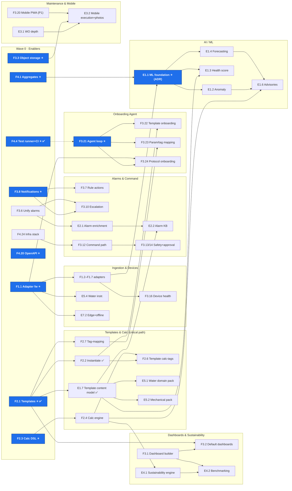

# TRINETRA / Enterprise EMS — Unified Pending-Feature Backlog

**This is the single managed backlog.** All pending scope — the original
north-star/client delta (`F` ids) and the Ion Exchange EMS SOW delta (`E` ids)
— lives here, with sequencing, dependencies, and live status. Update THIS file;
the source analyses are archived under [archive/](./archive/).

**Maintained by:** the human/AI team, every build cycle.
**Execution playbook:** [build-operating-model.md](./build-operating-model.md)
(per-feature loop, subagent fan-out rules, worktree isolation).
**Scope law:** nothing below is active scope until it has an ADR
(AGENTS.md §10); new dependencies are §9.4-gated. On promotion, mirror the item
into [roadmap.md](./roadmap.md).

---

## How to use this document

- **Status** column is the live tracker: `⬜ pending` · `🟡 ADR/planned` ·
  `🔵 in progress` · `✅ done` · `⛔ dropped`. Update it as part of each cycle's
  final commit.
- **Wave** = execution order layer (0 first). Items in the same wave are
  parallel-safe unless *Depends* says otherwise. Never start an item whose
  *Depends* entries aren't ✅.
- **⭐ enabler** = build serially, hands-on, never via cold subagent
  (operating model §3).
- **P** = priority (P0 blocks client MVP … P3 low). Effort in person-weeks,
  planning-grade.
- Adding scope? Append a row with the next free id (`F`/`E` per origin), set
  Wave by its dependencies, and note the source. Removing scope? Mark `⛔`,
  don't delete — provenance matters.

**Sources (archived, read-only):**
[pending-features](./archive/pending-features.md) ·
[sequencing](./archive/pending-features-sequencing.md) ·
[SOW delta](./archive/sow-ems-pending-features.md) ·
plus the assessment docs and `AGENTS.production.md` referenced therein.

---

## 1. Wave plan at a glance

```
WAVE 0  enablers+quick wins: [F4.4⭐ ✅] [F2.1⭐ ✅] F1.1⭐ F2.3⭐ F3.8⭐ F4.1/4.2⭐ F4.20⭐ F3.3⭐
        [F4.11 ✅] [F4.12 ✅] F3.6 F1.8 F1.9 F4.24 E8.1🟡 E8.2 E8.3 E8.4
        + ADRs(E1.1, E7.1, positioning)
WAVE 1  F1.2 F1.3 F1.4 F1.5 F1.6 F1.7 F1.10  [F2.2 ✅] F2.4  F3.7 F3.10 F3.1 F3.4 F3.11
        F4.5 F4.7 F4.8 [F4.10 ✅] F4.14 F4.23  [E1.7 ✅] E3.1 E5.4
WAVE 2  F2.5 F2.6 F2.7 F2.8  F3.2 F3.16 F3.20(P1↑)  F3.21⭐  F4.6 F4.15
        E5.1 E5.2 E2.1 E1.1⭐
WAVE 3  F3.22 F3.23 F3.24 F3.25 F3.26 F3.27  F3.12 F3.5
        E1.2 E1.3 E1.4 E4.1 E2.2 E3.2
WAVE 4  F3.13 F3.14 F4.9 F4.27 F4.13 F4.16 F4.17 F4.21 F4.25
        E4.2 E2.3 E7.2 E7.3 E3.3 E7.1(if ADR approves)
WAVE 5  F3.9 F3.17 F3.18 F3.19 F4.3 F4.18 F4.19 F4.22 F4.26 F1.11
        E1.5 E1.6 E4.3 E5.3 E6.1 E6.2 E7.4
```

**Critical path (protect Track B):**
`F2.1 ✅ → E1.7 ✅ → E5.1` ← **`E5.1` is now the head of this chain and both of
its dependencies are met.** And `F2.1 ✅ → F2.2 ✅ → F3.22` and
`F4.1 + F1.x → E1.1 → E1.3/E1.2`, converging on the Foundry demo: *a
water-treatment plant onboarded from a rich template by the onboarding agent,
with health scores, pre-threshold anomaly alerts, and enriched alarms.*

---

## 1a. What can run in parallel

Read parallelism off the tables above using **two axes**:

- **Wave = the time axis.** Items sharing a Wave are parallel-safe *unless*
  `Depends` says otherwise. `Depends` always wins over the wave grouping.
- **Track = the ownership axis.** Each track (A, B, C, D, E, M, ML, F) is a
  swim-lane one person or agent can own end-to-end. Tracks progress
  concurrently; the only hard hand-offs are the cross-track arrows in §3.

**An item is eligible to start when every entry in its `Depends` cell is `✅`
— nothing else.** Wave order is guidance for sequencing; `Depends` is the
constraint.

**Worked example.** Once `F1.1` (adapter framework) is `✅`, Wave 1 offers
`F1.2` Modbus · `F1.3` BACnet · `F1.4` OPC-UA · `F1.5` SNMP/REST · `F1.6` DCS —
same wave, same single dependency, separate files. That is a clean 5-way
fan-out. By contrast `F2.2` and `F2.4` are both Wave 1 but sit on *different*
chains (`F2.1` vs `F2.3`), so they parallelise with each other too.

**Which tracks are independently ownable:**

| Track | Owns | Starts after |
|-------|------|--------------|
| **A** Ingestion & Devices | adapters, device health, MQTT expansion | `F1.1` |
| **B** Data Model & Calc ⚠ *critical path* | templates, calc DSL/engine, domain packs | `F2.1`, `F2.3` |
| **C** Dashboards & Storage | dashboard builder, object storage, sustainability views | `F3.3` |
| **D** Alarms & Command | alarm unify, notifications, enrichment, command path | `F3.8`, `F3.6` |
| **E** Onboarding Agent | agent loop + template/param/protocol onboarding | *consumes A + B* |
| **M** Maintenance & Mobile | work-order depth, mobile execution | *(work-orders exist)* |
| **ML** AI & Intelligence | anomaly, health, forecasting, advisories | `E1.1` (ADR first) |
| **F** Platform Foundation | tests, security, API, scale, deploy | — (runs from day 1) |

**Never parallelise:**

- **⭐ enablers** — build serially and hands-on; they define the interfaces
  everything else depends on.
- **Items on the same chain** — if B lists A in `Depends`, A must be `✅` first.
- **Work touching the same files** — two agents editing one file will conflict.

**Staffing.** With a one-person team plus agents you do not get calendar
parallelism — you get *agent* parallelism, and the binding constraint becomes
human review bandwidth. The fan-out rules (when to spawn subagents, worktree
isolation, what must stay serial) live in
[build-operating-model.md](./build-operating-model.md) §3. For multi-person
allocations see the archived
[sequencing doc](./archive/pending-features-sequencing.md) §5.

---

## 1b. Parallel run plan (ready-to-dispatch slots)

Pre-computed concurrency slots, derived from the `Depends` column. **Each slot
is 2–4 jobs that can run at the same time** — hand them to separate agents or
separate people. Slots are sequential: start slot *N+1* when slot *N* is `✅`.

Legend: ⭐ = enabler (serial, hands-on — never a cold subagent) ·
🔒 = needs an ADR before build · ‖ = same track but **separate files**, so
still safe in parallel.

| Slot | Run in parallel | Tracks | Notes |
|------|-----------------|--------|-------|
| ~~**1**~~ **CLOSED** | ~~**F4.4** ⭐~~ ✅ · ~~F4.11~~ ✅ · ~~F4.12~~ ✅ · E8.1 🟡 | F | **F4.4** (ADR 0014, PR #1) — Vitest + coverage gate + `db:seed` run on every PR, so delegating to agents is safe from here. **F4.11 + F4.12** (ADR 0017, PR #2) — F4.11 shipped for operator *and* viewer once the write matrix gated the 16 mutating endpoints in rules/alarms/work-orders/maintenance, which carried `JwtAuthGuard` and no role check. **E8.1 partial** (🟡) — software scope only; the row's volume/object-storage/backup surface is deliberately *not* built, see [`docs/security/encryption-at-rest.md`](./security/encryption-at-rest.md). Its review raised **E8.3** and **E8.4** as new scope. |
| **2** *(part)* | ~~**F2.1** ⭐~~ ✅ · ~~F4.10~~ ✅ · **F1.1** ⭐ · **F3.8** ⭐ | B · F · A · D | **F2.1** (ADR 0015, PR #5) released the migration lock and opened the critical path — `E1.7`, `F2.2` and `F2.7` unblock. **F4.10** (PR #4) was pulled forward from wave 1: it was the only P0 in the unblocked set, and ADR 0017 names it as where the write matrix gets its end-to-end proof. `F1.1` and `F3.8` remain; `F3.8` still needs a §9.4 dependency ADR. |
| **3** | **F2.3** ⭐ · **F4.1** ⭐ · **F3.3** ⭐ | B · F · C | Second enabler batch. F2.3 continues track B (same owner as F2.1). |
| **4** *(part)* | F1.2 · ~~F2.2~~ ✅ · F3.6 | A · B · D | First dependents unlock: Modbus (needs F1.1), template instantiation (needs F2.1), alarm-engine unification (independent). **F2.2** (ADR 0015 Amendment 1, PR #7) was pulled forward from this slot the moment `F2.1` landed — it is P0, needs no DDL, and a template nobody can instantiate is a schema rather than a feature. `F1.2` still waits on `F1.1`. |
| **5** *(part)* | F1.3 · ~~**E1.7**~~ ✅ · F3.7 | A · B · D | **E1.7** (ADR 0019, PR #9) was pulled forward the moment `F2.1` landed — P0 critical path, no DDL, and it is the last thing between `main` and `E5.1`. It unblocks all three domain packs. F3.7 still needs F3.8. |
| **6** | F1.4 ‖ F1.5 ‖ F1.6 | A ‖ | **Flagship fan-out.** OPC-UA, SNMP/REST and DCS all implement the *same* frozen `F1.1` interface in their *own* files — the cleanest 3-agent parallel batch in the whole plan. |
| **7** | F2.4 · F3.1 · F4.20 | B · C · F | Calc engine (needs F2.3), dashboard builder, OpenAPI. |
| **8** | **E5.1** · F1.7 · F4.10 | B · A · F | E5.1 water-treatment domain pack — **P0 flagship**, Ion Exchange's core business (needs F2.1 + E1.7). |
| **9** | **E1.1** ⭐🔒 · F2.5 · E2.1 | ML · B · D | E1.1 (ML foundation) is the only new infrastructure the SOW adds — **ADR on the ML stack first**. |
| **10** | **F3.21** ⭐ · F2.7 · E1.3 · F3.2 | E · B · ML · C | Onboarding agent loop begins (needs create APIs + F4.4). **F2.7 (tag-mapping editor) must land here** — F3.23 in the next slot depends on it. |
| **11** | F3.22 ‖ F3.23 ‖ F3.24 | E ‖ | Second fan-out: agent template / param-mapping / protocol onboarding — separate capabilities, separate files, all gated on F3.21. |
| **12** | E1.2 · E4.1 · E3.1 | ML · C · M | Anomaly detection, sustainability metrics engine, work-order depth. |

Completing slot 12 reaches the **Foundry demo**: a water plant onboarded from a
rich template by the agent, with health scores, pre-threshold anomaly alerts,
and enriched alarms.

### Newly unblocked after slot 1 (2026-08-04)

Re-derived from the `Depends` column after `F4.4`, `F4.11` and `F4.12` went
`✅` — not read off the slot table, which assumes nothing is done yet.

| Item | P | Track | Why it matters now |
|------|---|-------|--------------------|
| **F4.10** | **P0** | F | **Take this before the other three.** ADR 0017 names it explicitly as where end-to-end proof of the write matrix belongs: the matrix is currently verified by unit tests over a pure function, so `scopeFromSource`'s query branches are still runtime-unverified. It is the only P0 in this set. |
| F4.5 | P1 | F | Integration tests w/ testcontainers — the harness F4.10 would build on. Consider pairing them. |
| F4.7 | P1 | F | Playwright E2E for critical UX paths. |
| F4.8 | P2 | F | k6 load tests. |

`F4.6` (contract tests) is **still blocked** — it needs `F4.23` as well as
`F4.4`. `F3.21` lists "create APIs, F4.4"; the `F4.4` half is now satisfied but
the create APIs are not, so it stays blocked and slot 10 is unchanged.

### ADR 0018 landed (2026-08-05, PR #3)

The telemetry-source axis is now separate from the spatial axis:
`assets.location_id` is `NOT NULL`, `assets.rtu_id` is nullable, and provenance
lives on `asset_points` (`rtu_id` + `source_kind`).

**`F1.8` and `F1.9` become genuinely buildable.** Both were listed with no
`Depends`, so the table already called them eligible — but the schema forbade
the thing they require: an asset with no gateway. That is the failure mode this
board cannot express, because `Depends` tracks *features*, not *constraints*.
Worth remembering when reading any other "eligible" row.

### Slot 2 opened: F2.1 and F4.10 landed (2026-08-05, PRs #5 and #4)

`F2.1` ⭐ is done, so the critical path is open. Newly unblocked, re-derived from
the `Depends` column rather than read off the slot table:

| Item | P | Track | Why it matters now |
|------|---|-------|--------------------|
| ~~**E1.7**~~ ✅ | **P0** | B | Template content model — the Ion Exchange overlay surface. `F2.1` shipped `asset_templates.content jsonb` as its reserved home, `{}` and contracted by a Zod schema E1.7 tightens. It was the last thing between here and `E5.1`. **Done 2026-08-05, ADR 0019, PR #9.** |
| ~~**F2.2**~~ ✅ | **P0** | B | Instantiate assets from a template. `F2.1` deliberately shipped `assets.template_id` so F2.2 adds **no DDL at all** — it does not take the migration lock. **Done 2026-08-05, PR #7.** |
| F2.7 | P1 | B | Tag-mapping bulk editor; `template_points.source_data_key_pattern` is its seed column. |

`E5.1`/`E5.2`/`E5.3` and `F3.2` list `F2.1` **and** something still pending
(`E1.7`, `F3.1`), so they stay blocked. `F3.21` lists "create APIs, F4.4" — the
`F4.4` half was already satisfied and the create-APIs half means the
*onboarding* create APIs, not the template ones, so it is unchanged. `F4.9`
needs `F4.5`–`F4.10` and only `F4.10` is done.

### F2.2 landed and unblocked nothing (2026-08-05, PR #7)

Recorded because a closed P0 that opens no new work is the case a cascade check
is most likely to get wrong by assuming. Both of `F2.2`'s dependents list a
*second* unmet dependency:

- **`F2.6`** (template calc-tags into the calc engine) needs `F2.2` **and**
  `F2.4`. `F2.4` needs `F2.3` ⭐, which is not started — so this is two enablers
  away, not one.
- **`F3.22`** (agent onboards templates conversationally) needs `F2.2` **and**
  `F3.21` ⭐, the onboarding agent loop, which is Wave 2.

So the critical path's next move is still **`E1.7`**, unchanged by this item.

### E1.7 landed and opened the flagship (2026-08-05, PR #9)

`E1.7` ⭐-adjacent but not starred; built serially and hands-on anyway, because
it is the last dependency of the client's core business. Newly unblocked,
re-derived from the `Depends` column rather than read off the slot table:

| Item | P | Wave | Why it matters now |
|------|---|------|--------------------|
| **E5.1** | **P0** | 2 | **Water-treatment domain pack** — STP/ETP/RO/UF/softeners/DM/cooling water/dosing/potable. Ion Exchange's core business and the Foundry demo's subject. Both of its dependencies (`F2.1`, `E1.7`) are now ✅. This is the flagship. |
| E5.2 | P1 | 2 | Mechanical/utility pack (pumps, compressors, chillers, AHUs, boilers). Same two dependencies, both met. |
| E5.3 | P2 | 5 | Facility/smart-building pack. Unblocked, but its wave is far out. |

**Still blocked, and worth recording so the next cascade check does not
re-derive it:** `E2.2` (alarm philosophy KB) needs `E1.7` **and** `E2.1`, which
is ⬜ and itself waits on `F3.6`. `E1.3` (asset health score) needs `E1.7` **and**
`E1.1` ⭐, the ML foundation, which is ADR-gated on a stack choice. Both are two
items away, not one.

**The lesson worth carrying forward.** `E1.7`'s backlog row promises six things.
Checked against `main` rather than against the row, **five of the six consumers
did not exist** — `F2.3`, `F3.1`, `E1.1`, `E1.6` and `E2.1` each own a vocabulary
the content model would otherwise have been inventing on their behalf. The row
was written as if the overlay were one feature; it is really five reopenings
gated on five different items.

That is not a defect in the row — a backlog cannot track which of its own future
items owns which vocabulary. It is a reason to check *consumer state* before
building anything described as "extend X to carry Y". The check is cheap (`grep`
the `Depends` column and look at `apps/api/src/`) and it changed this item's
design completely: from one guessed schema to a contract tiered by what is
actually buildable, with the unbuildable parts **rejected** rather than accepted
untyped. A reserved key that is silently accepted is worse than one that errors —
it lets `E5.1` author a shape `F3.1` will contradict a year later, with packs
already in the field.

**The ADR-contradiction note worth carrying forward.** ADR 0015 §7 specified an
instantiate predicate — `canManageTemplate` **and** `canManageLocation` — that
no `location_admin` can ever satisfy, because `canManageTemplate` is false for
that role by the same section's design. The ADR's own prose two lines below
said location admins must be able to deploy. Both statements were written on the
same day and reviewed; the conjunction still shipped as the spec.

It survived because §7 reads as a permissions table, and permissions tables get
checked for what they *forbid*. Nobody re-derives whether each row is
*satisfiable*. The build caught it only because instantiation is the first
feature that actually calls the predicate — `F2.1` defined `canManageTemplate`
and never exercised the instantiate row. **A rule with no caller is not
verified by being reviewed**, which is the same lesson as the F4.10 note below
arriving from the opposite direction: there, assertions that could not fail; here,
a rule that could not pass.

**The F4.10 note worth carrying forward.** Two of its assertions shipped in a
state where they *could not fail*, and only measurement found it: a fresh
database had 147 assets and **zero** with a null `rtu_id`, so the ADR 0018
visibility check never executed one iteration; and 16 locations with **zero**
inactive, so `WHERE active = true` was indistinguishable from no filter in all
four scope branches. The fix was a fixture, not an assertion —
`packages/db/src/access-fixtures-seed.ts` now seeds a decommissioned location
and a hand-read meter. Both mutations that should break those checks now do;
one of them passed before. Worth remembering when reading any test that asserts
an *absence*: it is only as strong as the fixture's ability to produce the thing
that should be absent.

`F4.10` also pinned a property that is **not obviously right** and belongs to a
future ADR: an unprovisioned `admin` token resolves to a global scope, so
deleting a `bms.users` row does not revoke a token — it restores whatever role
the token claims until `JWT_TTL`. Pre-existing, not client-forgeable, and now
visible instead of latent.

Still out of scope and belonging to the companion ADR: location depth
(`locations.parent_id`), asset composition (`parent_asset_id`), and the
Eskom-era `locations.type` union. That ADR is unblocked on its design question
— a grant on a parent location **does** imply its descendants, recorded in ADR
0018 — but has not been written.

Slot 2 (`F1.1` ⭐ · `F2.1` ⭐ · `F3.8` ⭐) remains the recommended next batch —
these are the enablers that unblock the most downstream work. `F2.1` holds the
migration lock (one migration-bearing job at a time; the drizzle journal is a
single shared file). `F3.8` needs a dependency ADR before build.

**How to use this**

- Dispatching 2–3 jobs from one slot is the intended unit of work. With one
  human + agents, the practical limit is **review bandwidth**, not slot width —
  see [build-operating-model.md](./build-operating-model.md) §5.
- ⭐ items in the same slot are independent of each other, so *different people*
  can take them concurrently — but each should be built hands-on, not handed to
  a cold subagent.
- Give each parallel job its own git worktree/branch (operating model §3).
- **This plan assumes slots complete in order and nothing is `✅` yet.** Once
  statuses change, re-derive rather than trusting the table: the rule is
  *"every `Depends` entry is `✅`"*. `/backlog-cycle next` recomputes it live.
- P2/P3 long-tail items (`F3.9`, `F3.17`–`F3.19`, `F4.18`, `F4.19`, `E6.x`,
  `E7.4`, `E1.5`, `E1.6`, `E4.3`, `E5.3`) are unscheduled here — most have no
  blockers and can backfill any spare capacity.

---

## 2. The backlog

### Track A — Ingestion & Devices

| ID | Feature | P | Effort | Wave | Depends | Status |
|----|---------|---|--------|------|---------|--------|
| **F1.1** | Ingest adapter framework (`IngestAdapter`, pluggable) ⭐ | P0 | 4–5 | 0 | — | ⬜ |
| F1.8 | Manual time-series entry API + UI. **Genuinely buildable as of ADR 0018** — `assets.rtu_id` was `NOT NULL`, so an asset with no gateway could not exist and a hand-entered reading had nowhere to live. Points now carry `source_kind = 'manual'` | P0 | 2–3 | 0 | — | ⬜ |
| F1.9 | Telemetry history bulk import (CSV/Excel). **Genuinely buildable as of ADR 0018** — same constraint; imported points may also land as `'unmapped'` before their gateway is wired | P0 | 3–4 | 0 | — | ⬜ |
| F1.2 | Modbus TCP/RTU adapter | P0 | 10–12 | 1 | F1.1 | ⬜ |
| F1.3 | BACnet/IP read adapter | P0 | 10–12 | 1 | F1.1 | ⬜ |
| F1.4 | OPC-UA subscription adapter | P1 | 10–14 | 1 | F1.1 | ⬜ |
| F1.5 | SNMP + REST poller adapters | P1 | 8–10 | 1 | F1.1 | ⬜ |
| F1.6 | DCS / SCADA / PLC connector (client-specific) | P0 | 8–12 | 1 | F1.1 | ⬜ |
| F1.7 | Expand MQTT ingest beyond single PHE RTU | P0 | 3–4 | 1 | F1.1 | ⬜ |
| F1.10 | Adapter backpressure: broker-disconnect backoff + 1 h disk buffer | P1 | 3–4 | 1 | F1.1 | ⬜ |
| E5.4 | Water-quality & flow instrumentation ingestion (analysers, flow/pressure/level/vibration) | P1 | 3–4 | 1 | F1.1 | ⬜ |
| F3.15 | Device / asset / RTU CRUD APIs (beyond admin/onboarding) | P1 | 4–6 | 1 | — | ⬜ |
| F3.16 | Device health / last-seen / heartbeat | P1 | 3–4 | 2 | F1.x | ⬜ |
| E7.2 | Edge gateway runtime: extended buffering, offline ops, store-and-forward sync | P1 | 8–12 | 4 | F1.1, F1.10 | ⬜ |
| E6.1 | IEC 60870 adapter | P2 | 8–10 | 5 | F1.1 | ⬜ |
| F1.11 | Formalise ingest normaliser as only `telemetry.*` writer | P2 | 2 | 5 | — | ⬜ |
| F3.17 | OTA firmware module | P3 | 10+ | 5 | — | ⬜ |
| F3.18 | X.509 device certificate management | P2 | — | 5 | — | ⬜ |

### Track B — Data Model, Templates & Calculations *(critical path)*

| ID | Feature | P | Effort | Wave | Depends | Status |
|----|---------|---|--------|------|---------|--------|
| **F2.1** | Asset template schema (`asset_templates` + `template_points`) ⭐ — ADR 0015, PR #5. A row *is* a version; `assets.template_id` pins it, published versions are immutable, editing one creates the next draft. `template_points.kind` (`measured\|derived`) already carves out what `F2.2` must not instantiate | P0 | 10–12 | 0 | — | ✅ |
| **F2.3** | Calculation formula DSL + definition schema ⭐ | P0 | 8–10 | 0 | — | ⬜ |
| **F2.2** | Instantiate assets from template (model-once-deploy-many) — ADR 0015 §6/§7 **as amended**, PR #7. `POST /admin/asset-templates/:id/instantiate`, no DDL. Target is `rtuId` **xor** `locationId`: through an RTU the points are `measured`, through a location alone `unmapped` (ADR 0018's source axis). Derived points are never instantiated. All-or-nothing — every fallible check runs before the transaction opens | P0 | 4–5 | 1 | F2.1 | ✅ |
| F2.4 | Calc execution engine (streaming + scheduled) | P0 | incl. | 1 | F2.3 | ⬜ |
| **E1.7** | Template content model extension: KPIs, alarm philosophies, class-level maintenance plans, dashboard point ordering (Ion Exchange overlay surface). **ADR 0019, PR #9.** Tiered by whether a consumer exists — `health` (E1.1) and `optimisation` (E1.6) are *rejected*, not accepted untyped; `dashboards` carries ordering only until `F3.1`. Each reopens as its consumer lands. | P0 | 3–4 | 1 | F2.1 | ✅ |
| F2.5 | Calculation configuration UI | P0 | 4–5 | 2 | F2.4 | ⬜ |
| F2.6 | Template calc-tags wired into calc engine | P0 | 3–4 | 2 | F2.2, F2.4 | ⬜ |
| F2.7 | Tag-mapping bulk editor + Excel mapping sheet | P1 | 4–5 | 2 | F2.1 | ⬜ |
| F2.8 | Replace hardcoded PUE SQL with user-defined derived tags | P1 | incl. | 2 | F2.4 | ⬜ |
| **E5.1** | Water-treatment domain pack: catalogs + templates for STP/ETP/RO/UF/softeners/DM/cooling water/dosing/potable | P0 | 6–8 | 2 | F2.1, E1.7 | ⬜ |
| E5.2 | Mechanical/utility domain pack: pumps, compressors, motors, chillers, cooling towers, AHUs, boilers | P1 | 4–6 | 2 | F2.1, E1.7 | ⬜ |
| E5.3 | Facility/smart-building domain pack: lighting, fire, access, occupancy, parking, IAQ, BAS | P2 | 6–8 | 5 | F2.1, E1.7 | ⬜ |

### Track C — Dashboards, Storage & Reporting

| ID | Feature | P | Effort | Wave | Depends | Status |
|----|---------|---|--------|------|---------|--------|
| **F3.3** | Object storage (MinIO/S3) + `asset_images` metadata ⭐ | P1 | 8–12 | 0 | — | ⬜ |
| F3.1 | Configurable dashboard schema + builder UI (core widgets) | P0 | 14–18 | 1 | — | ⬜ |
| F3.4 | Image upload API + asset linkage | P1 | incl. | 1 | F3.3 | ⬜ |
| F3.2 | Per-asset-type default dashboards from template | P1 | 3–4 | 2 | F2.1, F3.1 | ⬜ |
| F3.5 | Scheduled PDF / Excel energy reports | P2 | 4–6 | 3 | F3.1, F4.1 | ⬜ |
| E4.1 | Sustainability metrics engine: savings baselines (energy/water/chemical), carbon factors, downtime/efficiency deltas as derived tags | P1 | 6–8 | 3 | F2.4 | ⬜ |
| E4.2 | Sustainability & benchmarking dashboards (daily→enterprise, cross-site) + stakeholder persona defaults | P1 | 4–6 | 4 | E4.1, F3.1 | ⬜ |
| E4.3 | Water-balance / wastewater-recovery analytics | P2 | 4–6 | 5 | E4.1, E5.1 | ⬜ |

### Track D — Alarms, Rules, Notifications & Commanding

| ID | Feature | P | Effort | Wave | Depends | Status |
|----|---------|---|--------|------|---------|--------|
| **F3.8** | Email + webhook notification service ⭐ | P0 | 4–6 | 0 | — | ⬜ |
| F3.6 | Unify alarm engine (merge `AlarmThresholdService` into DB rules) | P0 | 4–6 | 0 | — | ⬜ |
| F3.7 | Execute rule actions (rules store `notify` but never fire) | P0 | incl. | 1 | F3.8 | ⬜ |
| F3.10 | Alarm escalation profiles + auto-clear on normal | P1 | 4–6 | 1 | F3.6, F3.8 | ⬜ |
| F3.11 | Scheduled / cron rule evaluation (BullMQ workers) | P1 | 4 | 1 | F4.24 | ⬜ |
| E2.1 | Alarm enrichment schema: root cause, impact, affected assets, corrective actions, energy/water/production impact, ETR, skills | P1 | 4–6 | 2 | F3.6 | ⬜ |
| E2.2 | Template-driven alarm philosophy KB per asset class | P1 | 3–4 | 3 | E1.7, E2.1 | ⬜ |
| F3.12 | Two-way command path: `commands`+`command_results`, queue + MQTT downlink | P1 | 8–10 | 3 | F4.24 | ⬜ |
| F3.13 | Command safety gate (interlocks, time windows, role limits) | P1 | incl. | 4 | F3.12 | ⬜ |
| F3.14 | Dual-approval workflow for `requires_approval` assets | P1 | 3–4 | 4 | F3.12 | ⬜ |
| E2.3 | AI-assisted root-cause suggestions on live alarms | P2 | 4–6 | 4 | E1.2, E2.1 | ⬜ |
| F3.9 | SMS / push notification channels | P2 | 3–4 | 5 | F3.8 | ⬜ |

### Track E — Onboarding Agent *(integration finale of A + B)*

| ID | Feature | P | Effort | Wave | Depends | Status |
|----|---------|---|--------|------|---------|--------|
| **F3.21** | Tool-calling agent loop (invokes real create APIs; not single-shot JSON draft) ⭐ | P0 | 5–7 | 2 | create APIs, F4.4 | ⬜ |
| F3.22 | Agent onboards asset templates (create + instantiate) conversationally | P0 | 4–5 | 3 | F2.2, F3.21 | ⬜ |
| F3.23 | Agent onboards parameters (point keys) + asset tags and maps source↔tag via Q&A | P0 | 3–4 | 3 | F3.21, F2.7 | ⬜ |
| F3.24 | Agent drives protocol-based device onboarding (per-adapter discovery/prompts) | P1 | 3–4 | 3 | F3.21, F1.1 | ⬜ |
| F3.25 | Question-driven UX with per-step confirm + rollback | P1 | 3–4 | 3 | F3.21 | ⬜ |
| F3.26 | Agent grounding on org catalog/templates/protocols (retrieval, not scripts) | P1 | 2–3 | 3 | F3.21 | ⬜ |
| F3.27 | Deterministic rule-based fallback parity (no LLM key) | P2 | 2–3 | 3 | F3.21 | ⬜ |

### Track M — Maintenance & Mobile *(SOW §6)*

| ID | Feature | P | Effort | Wave | Depends | Status |
|----|---------|---|--------|------|---------|--------|
| E3.1 | Work-order depth: maintenance checklists, root-cause documentation, closure approval, richer audit | P1 | 4–6 | 1 | *(module exists)* | ⬜ |
| F3.20 | Mobile PWA / responsive ops app — **P2→P1 (SOW §6 requires mobile execution)** | P1 | 16+ | 2 | — | ⬜ |
| E3.2 | Mobile work execution + photographic evidence | P1 | 6–8 | 3 | E3.1, F3.3, F3.20 | ⬜ |
| E3.3 | CMMS/EAM integration connector | P2 | 4–6 | 4 | E3.1, F4.20 | ⬜ |
| F3.19 | 3D control room (Three.js) | P3 | — | 5 | — | ⬜ |

### Track ML — AI & Engineering Intelligence *(SOW §4)*

| ID | Feature | P | Effort | Wave | Depends | Status |
|----|---------|---|--------|------|---------|--------|
| **E1.1** | ML serving foundation: model runtime (batch+streaming scoring), feature extraction from aggregates, model registry ⭐ — **ADR first (stack choice)** | P1 | 8–12 | 2 | F4.1, F1.x, ADR | ⬜ |
| E1.2 | Multi-variate anomaly detection (pre-threshold, per asset class) | P1 | 8–10 | 3 | E1.1 | ⬜ |
| E1.3 | Asset Health Score — asset → plant → enterprise rollups | P1 | 6–8 | 3 | E1.1, E1.7 | ⬜ |
| E1.4 | Predictive forecasting: energy/water/chemical/utility demand | P1 | 6–8 | 3 | E1.1 | ⬜ |
| E1.5 | Asset degradation + Remaining Useful Life + maintenance-schedule forecasts | P2 | 8–10 | 5 | E1.3, E3.1 | ⬜ |
| E1.6 | Optimisation advisories with quantified ₹/kWh/kL/CO₂ benefits | P2 | 10–14 | 5 | E1.2, E1.4, F2.4 | ⬜ |

### Track F — Platform Foundation (tests, security, API, scale, deploy)

| ID | Feature | P | Effort | Wave | Depends | Status |
|----|---------|---|--------|------|---------|--------|
| **F4.4** | Real test runner (Vitest) **+ CI wiring** — `test:coverage`, `typecheck:tests` and `db:seed` now run on every PR (ADR 0014, PR #1) ⭐ **FIRST** | P0 | 4–6 | 0 | — | ✅ |
| F4.11 | Fix operator/viewer RBAC — default read scope. Done for **both** roles; gated by the ADR 0017 operations write matrix so a read scope no longer implies write access | P0 | 2 | 0 | — | ✅ |
| F4.12 | Disable local-JWT fallback when `OIDC_ISSUER` set | P0 | 1 | 0 | — | ✅ |
| F4.1 | Continuous aggregates (`point_values_1m/_5m/_1h/_1d`) ⭐ | P0 | 4–5 | 0 | — | ⬜ |
| F4.2 | Retention policy (`compress_after 7d`, `drop_after 2y`) | P0 | incl. | 0 | F4.1 | ⬜ |
| F4.20 | OpenAPI / Swagger for all `/api/v1` routes ⭐ | P0 | 2–3 | 0 | — | ⬜ |
| F4.24 | Infra: `apps/worker` (BullMQ), EMQX, Traefik, MinIO in stack | P2 | infra | 0 | — | ⬜ |
| E8.1 | Encryption at rest — **software scope done; disk/volume encryption is a host responsibility, not code.** Delivered: [`docs/security/encryption-at-rest.md`](./security/encryption-at-rest.md) (what is/isn't encrypted + deployer requirements), `.dockerignore` fix stopping nested `.env` secrets from being baked into images (+ CI invariant), `CREDENTIAL_ENCRYPTION_KEY` wired into the compose `api` service. **NOT delivered:** DB-volume encryption (deployer/platform — LUKS/BitLocker/KMS), object storage → F3.3, backup encryption → E8.2, onboarding credential exposure → E8.3, key rotation + unconfigured-key visibility → E8.4. **Volume encryption is deliberately unowned by any backlog id** — it is a deployer/platform action (LUKS/BitLocker/KMS), not code; see §8 of the security doc. | P1 | 2–3 | 0 | — | 🟡 |
| E8.2 | Automated backup & recovery (scheduled, tested restores) | P1 | 3–4 | 0 | — | ⬜ |
| E8.3 | Onboarding credential exposure — **three vectors, must close together.** (1) `onboarding_sessions.messages` stores the raw chat turn, and the wizard prompts admins to paste MQTT credentials into it (`onboarding-chat.service.ts:88,313,531`); (2) `GET /admin/onboarding/sessions/:id` returns `messages` verbatim (`onboarding.service.ts:339`) behind `JwtAuthGuard` with no role/org check, so **any authenticated user** can read another admin's pasted password; (3) `handleOpenAiTurn` forwards the raw user turn to OpenAI unredacted (`onboarding-chat.service.ts:209`), an open gap against ADR 0011 decision 4. Raised by the E8.1 security review. | P1 | 2–3 | 0 | — | ⬜ |
| E8.4 | `CREDENTIAL_ENCRYPTION_KEY` rotation + unconfigured-key visibility. No re-encryption path exists (`key_version` hard-coded to 1), so a compromised key cannot be retired without re-entering every RTU credential. Separately, an unset key fails closed on *storage* but **open on authentication** — the draft still reports `credentialsSet: true` and ingest silently falls back to the global `MQTT_USERNAME`/`MQTT_PASSWORD` while reporting `source: "db"`. Deferred by ADR 0012; raised by the E8.1 security review. | P1 | 2–3 | 0 | — | ⬜ |
| F4.5 | Integration tests w/ testcontainers (PG + Timescale + Redis) | P1 | 6–8 | 1 | F4.4 | ⬜ |
| F4.7 | E2E (Playwright) for critical UX paths | P1 | 4–6 | 1 | F4.4 | ⬜ |
| F4.8 | Load tests (k6): 5,000 meters @ 1 Hz, 1,000 users | P2 | 3–4 | 1 | F4.4 | ⬜ |
| F4.10 | Automated access-control integration tests — PR #4. All four `scopeFromSource` query branches against a real seeded database, each with its negative half, plus the DB-role-beats-JWT-claim rule ADR 0017 rests on. Also seeds the two states the rest of the seed never produced (a gateway-less asset, an inactive location), without which two assertions could not fail — see the note below | P0 | 3 | 1 | F4.4 ✅ | ✅ |
| F4.14 | Audit read API + export | P1 | 2–3 | 1 | — | ⬜ |
| F4.23 | `packages/contracts` (Zod), `packages/ui`, `telemetry-sdk` | P2 | 6–8 | 1 | F4.20 | ⬜ |
| F4.6 | Contract tests (API ↔ web via contracts pkg) | P1 | incl. | 2 | F4.4, F4.23 | ⬜ |
| F4.15 | Append-only audit + nightly hash-chaining | P2 | 3–4 | 2 | F4.14 | ⬜ |
| F4.9 | Coverage gates (80% line / 95% command·alarm·audit·RBAC) | P1 | CI | 4 | F4.5–F4.10 | ⬜ |
| F4.13 | Keycloak MFA on pilot realm | P1 | 2 | 4 | — | ⬜ |
| F4.16 | Row-level security on cross-tenant tables | P2 | 4–6 | 4 | — | ⬜ |
| F4.17 | API rate limiting + service-account tokens | P1 | 3–4 | 4 | — | ⬜ |
| F4.21 | RFC 7807 error envelope + correlation id + idempotency keys | P1 | 3–4 | 4 | — | ⬜ |
| F4.25 | SLO instrumentation (API p95<250ms, alarm p99<2s, command p99<3s) | P2 | 3 | 4 | — | ⬜ |
| F4.27 | Kubernetes prod deploy + HA (PG replica, Redis Sentinel) | P1 | 8–12 | 4 | — | ⬜ |
| E7.1 | **Multi-tenant architecture** — ⚠ re-opens superseded decision; **ADR first** | P1 | 10–14 | 4 | ADR, F4.16 | ⬜ |
| E7.3 | On-prem/hybrid packaging + disaster-recovery runbooks | P1 | 6–8 | 4 | F4.27 | ⬜ |
| F4.3 | Raw-message archive + ingest dead-letter diagnostics | P2 | 3 | 5 | — | ⬜ |
| F4.18 | mTLS for inter-service traffic | P2 | — | 5 | — | ⬜ |
| F4.19 | OWASP ASVS L2/L3, NERSA / ISO 50001 compliance track | P2 | track | 5 | — | ⬜ |
| F4.22 | Cursor pagination on hot list endpoints | P2 | 2 | 5 | — | ⬜ |
| F4.26 | Frontend perf budgets (≤250 kB gzip, LCP ≤2.5 s) | P3 | 2 | 5 | — | ⬜ |
| E6.2 | Enterprise export connectors: ERP, historians, data lakes | P2 | 4–6 | 5 | F4.20 | ⬜ |
| E7.4 | Secure remote access (VPN / zero-trust site links) | P2 | 3–4 | 5 | E7.3 | ⬜ |

---

## 3. Dependency map



---

## 4. Superseded / decided-differently — NOT pending

| Item | Superseded by | Reality |
|------|---------------|---------|
| North-star hierarchy `Tenant→Site→Building→Floor→Zone` | ADR 0008 | Implemented as `Organization→Location→RTU→Asset→Point` — by design. |
| `bms.gateways`/`gateway_devices` | ADR 0008 | Realised as `bms.rtus` with `ingest_enabled`/`mqtt_topic`. |
| Multi-tenant MSP / white-label | AGENTS.md §6 (deferred) | **⚠ Ion Exchange SOW §11 re-opens this** → tracked as E7.1; requires ADR before it counts as pending. |
| Two-way commanding as *default* posture | AGENTS.md §6 | Deferred; F3.12–F3.14 are future targets. Browser realtime stays read-only. |
| BullMQ / EMQX / MinIO / Three.js / shadcn on `main` today | AGENTS.md §6 | Genuine targets (F4.24 etc.) but out of scope until promoted. |

## 5. Decision ADR queue (draft before the affected items start)

| ADR needed | Blocks | Question |
|------------|--------|----------|
| Multi-tenancy re-open | E7.1, informs F4.16 | SOW §11 vs. superseded decision — one platform, tenant model? |
| ML stack | all E1.x | Runtime (Python svc / Node / external), registry, serving path. |
| ~~Product positioning~~ | — | **Resolved by ADR 0013 (2026-08-04):** this repo forked to the TRINETRA Enterprise EMS line for Ion Exchange (India) Ltd.; display-layer rebrand only, Eskom-era internals retained. Eskom line continues from the external backup, if at all. |
| ~~Test runner + libs~~ | ~~F4.4~~ | **Resolved by ADR 0014 (2026-08-04):** Vitest + `@vitest/coverage-v8`, projects-per-app, coverage as a ratchet. |
| **Encryption-at-rest boundary** ⚠ | E8.1 (already merged) | **Open — human decision.** E8.1 landed with no ADR while every sibling in its wave got one, yet it made two architectural calls: *volume encryption is permanently outside this repo's scope* (deployer/platform action) and *fail closed on an unset key*. Options: write a retro `0020-encryption-at-rest-boundary.md` (`0018` is the source-axis ADR and **`0019` was taken by the E1.7 content model on 2026-08-05**; `0020` is the next free number — check `docs/adr/` again before writing, this reservation has now gone stale twice), or record an explicit documented exemption in the E8.1 row. Raised by the E8.1 compliance review. **Scope note:** the deferred item is *volume/full-disk/KMS* encryption only — object-storage bucket encryption is `F3.3` and encrypted backups are `E8.2`, both live backlog scope. A promotion sweep briefly widened this to all three; corrected before merge. |
| Per-feature ADRs | each promotion | Standard AGENTS.md §10 flow (Modbus/BACnet libs, `bullmq`, `nodemailer`, `minio`, …). |

**Owed `chore(agents):` promotions** — ✅ **cleared 2026-08-05** in one
`chore(agents):` PR (#8).

That batching was a **one-off, allowed by explicit human decision** to discharge
a backlog that had accumulated across five ADRs. It is **not** the rule going
forward: AGENTS.md §10.1 now says one owed promotion per `chore(agents):` PR,
and batching needs to be asked for. An agent had read §9.10's "a PR prefixed
`chore(agents): ...`" permissively and then written that reading into the
rulebook — convenient, and not clearly what §9.10 says.

| Owed | Source | Landed as |
|------|--------|-----------|
| ~~ADR 0015~~ ✅ | F2.1, F2.2 | AGENTS.md §2 Asset templates row, §3 (`src/admin/asset-templates/`), §4.7, §6. |
| ~~ADR 0016~~ ✅ | F1.1 | §2 Ingest adapters row and §6, both stating the **interface only** is promoted — F1.1 is not built and each protocol still needs its own §9.4 ADR. The `zod`/`typescript` manifest entries land with F1.1, not here. |
| ~~ADR 0017~~ ✅ | F4.11 | New AGENTS.md **§4.7**, holding both role gates — master-data scope predicates and the operations write matrix — in one place. |
| ~~§4.6 carve-out~~ ✅ | ADR 0014 | §4.6 records the `tests/` inline-assertion carve-out and the asymmetric `DATABASE_URL` gate. §3 gained `tests/`, `.claude/`, `vitest.config.ts`, `TRINETRA.html`, `CLAUDE.md`, `docs/security/`, `docs/archive/`, `docs/scripts/`, `BACKLOG.md` and `build-operating-model.md`. |
| ~~Roadmap mirror~~ ✅ | Wave 0–1 batch | Six new `docs/roadmap.md` sections (F4.11/F4.12, E8.1, F4.10, F2.1/F2.2, F1.1, ADR 0018) plus a note that the phase crosswalk is not the current board. |
| ~~Status line~~ ✅ | drift | Was "Phase 5 Sprint J/K/L/M/N"; now names the SOW backlog delivery and every merged ADR. |

Two corrections made while doing it: the §3 entry owed as `scripts/` is
actually **`docs/scripts/`** (there is no top-level `scripts/`), and `exports/`
was missing from the tree entirely.

**§10 was amended, and that is the part worth a second look.** The sweep
discharged §10 while breaking two of its five steps: step 2 (copy from
`docs/AGENTS.production.md`) does not apply to ADR-sourced promotion, and
step 5 (land before the feature) is *impossible* for it — §9.10 forbids the
rulebook edit riding in the feature PR, so it can only land after. Review
found step 5 has **never** been followed: `379fac6` landed after `70b6bf7`,
`492bd1a` after `f954958`. New **§10.1** describes what actually happens, so
the next sweep does not deviate silently again. The ADR gate itself is
unchanged and still precedes the feature. §10.1 covers ADR-sourced origin and
the inverted step 5 only — a third clause permitting batched sweeps was
proposed and **rejected**; §10.1 requires one promotion per PR instead.

**Still owed, and deliberately not bundled here:** the retro ADR for E8.1's
encryption boundary and the ADR 0016 cutover owner for
`apps/ingest/src/index.js` are **decisions**, not documentation of decisions
already made. They belong in `docs/adr/`, gated by the human, not in a
`chore(agents):` sweep.

## 6. Instrumentation / hardware note (SOW §8)

Sensor, gateway and edge **hardware supply** (meters, transmitters, analysers,
dosing equipment) is delivery/procurement scope — visible in project planning,
**not** in this software backlog.
