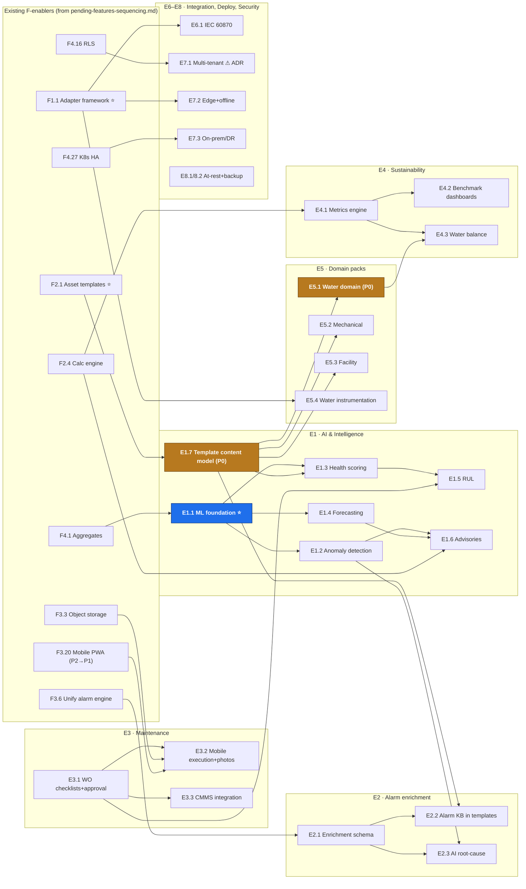

> **ARCHIVED (2026-08-04).** This analysis is frozen. The live, managed
> backlog — statuses, sequencing, and dependency map — is
> [docs/BACKLOG.md](../BACKLOG.md). Do not update this file.

# SOW Delta — Enterprise EMS / AI Monitoring & Optimisation Foundry (Ion Exchange)

**Generated:** 2026-08-04
**Source:** `SOW - Enterprise EMS - Euphoria Infotech.pdf` (10 pages, Euphoria
Infotech ↔ **Ion Exchange (India) Ltd., Bangalore**).
**Purpose:** Reconcile the client SOW against the existing platform (`main`) and
the already-tracked backlog ([pending-features.md](./pending-features.md)), and
extract the **additional** features the SOW introduces — with their own
sequencing and dependency map that plugs into
[pending-features-sequencing.md](./pending-features-sequencing.md).
**Execution model:** unchanged — [build-operating-model.md](../build-operating-model.md).

> **ID convention:** new SOW-only features get `E<area>.<n>` ids ("E" for EMS).
> `F<x>.<n>` ids refer to the existing backlog in `pending-features.md`.
> Effort in person-weeks (pw), planning-grade. Scope promotion still requires an
> ADR per AGENTS.md §10.

---

## 1. What the SOW actually asks for (positioning shift)

The SOW is **not** a restatement of the current BMS. It reframes the product as
an **"Enterprise AI Monitoring & Optimisation Foundry"** (SOW §14): Euphoria
builds the digital foundation (connectivity, data, visualisation), and **Ion
Exchange overlays proprietary engineering templates, AI models and optimisation
logic** on top. Three consequences:

1. **The template system (`F2.1`) is the product's spine** — SOW §4.1 makes
   templates carry KPIs, alarm philosophies, dashboards, health models,
   maintenance rules and optimisation logic, far beyond the tag-list template
   already planned.
2. **A first-class AI/ML layer is now in scope** (anomaly detection, health
   scoring, forecasting, RUL, advisories) — previously a one-line "advanced"
   footnote.
3. **New asset domains** — above all **water infrastructure** (STP/ETP/RO/UF/
   dosing — Ion Exchange's core business), plus mechanical/utility and
   facility/smart-building classes.

## 2. Coverage matrix — SOW section → existing backlog

| SOW § | Ask | Coverage on `main` + F-backlog | Verdict |
|-------|-----|-------------------------------|---------|
| §2 | IoT connectivity, acquisition/normalisation | `F1.1`–`F1.7`, ingest normaliser | ✅ tracked |
| §2 | Asset onboarding & configuration | Onboarding wizard + §3d agent | ✅ tracked |
| §2 | Time-series management | TimescaleDB + `F4.1/F4.2` | ✅ tracked |
| §2/§9 | Dashboards (stakeholder-configurable) | `F3.1/F3.2` | ⚠ persona/benchmark views new → E4.2 |
| §2/§5 | Alarm & event management | `F3.6`–`F3.11` | ⚠ enrichment new → E2.x |
| §2 | Workflow & notification engine | `F3.8`, work-orders module | ⚠ maintenance depth new → E3.x |
| §2 | Reporting & analytics | `F3.5` | ⚠ sustainability new → E4.x |
| §2/§10 | API mgmt & integration | `F4.20`, `F4.17`, `F1.6` | ⚠ IEC 60870/ERP/CMMS new → E6.x |
| §2/§12 | RBAC, SSO, audit | Keycloak/OIDC, scopes, audit write | ✅ + `F4.11`–`F4.15` |
| §2 | Mobile accessibility | `F3.20` (P2) | ⚠ **priority bump** → P1 (E3.2 needs it) |
| §3 | Water/mechanical/facility asset classes | electrical/HVAC/UPS/env only | ❌ new → E5.x |
| §4.1 | Rich engineering templates | `F2.1` (tag-level only) | ⚠ extend → E1.7 |
| §4.2–4.5 | Anomaly, health, forecasting, RUL, advisories | one footnote in §6 sequencing | ❌ new → E1.x |
| §5 | Alarm root-cause/impact/actions/skills | none | ❌ new → E2.1–E2.3 |
| §6 | Checklists, mobile execution, photos, closure approval, CMMS | work-orders: states/Kanban/audit only | ❌ new → E3.1–E3.3 |
| §7 | Sustainability metrics, carbon, benchmarking | none (PUE only) | ❌ new → E4.1–E4.3 |
| §8 | Instrumentation & edge devices | MQTT ingest, `F1.x` | ⚠ edge/offline new → E7.2 |
| §11 | Cloud/on-prem/hybrid, HA, DR | `F4.27` (K8s HA) | ⚠ DR/backup/hybrid new → E7.3, E8.2 |
| §11 | **Multi-tenant architecture** | **explicitly superseded/deferred** in `pending-features.md` §5 | ⚠ **SOW re-opens a settled decision → ADR required** → E7.1 |
| §11 | Edge computing, offline buffering & sync | `F1.10` (1 h disk buffer) partial | ⚠ new → E7.2 |
| §12 | MFA, encryption at rest, backup/recovery | `F4.13`; TLS in transit only | ⚠ new → E8.1, E8.2 |

## 3. Additional pending features (the E-list)

### E1. AI & Engineering Intelligence *(SOW §4 — the "Foundry" core)*

| ID | Feature | P | Effort | Depends on |
|----|---------|---|--------|-----------|
| **E1.1** | **ML serving foundation** ⭐ — model runtime/service (batch + streaming scoring), feature extraction from continuous aggregates, model registry & versioning | P1 | 8–12 | `F4.1`, ingest (`F1.x`) |
| E1.2 | Multi-variate anomaly detection (per asset class; pre-threshold detection) | P1 | 8–10 | E1.1 |
| E1.3 | Asset Health Score — asset → plant → enterprise rollups | P1 | 6–8 | E1.1, E1.7 |
| E1.4 | Predictive forecasting: energy/water/chemical demand, utility demand | P1 | 6–8 | E1.1 |
| E1.5 | Asset degradation & Remaining Useful Life (RUL) + maintenance-schedule forecasts | P2 | 8–10 | E1.3, E3.1 (history) |
| E1.6 | Optimisation advisories with quantified ₹/kWh/kL/CO₂ benefits (pump sequencing, chiller/CT/boiler/HVAC/dosing) | P2 | 10–14 | E1.2, E1.4, `F2.4` |
| E1.7 | **Template content model extension** — templates carry KPIs, alarm philosophies, default dashboards, health-model & maintenance-rule & optimisation hooks (the Ion Exchange overlay surface) | **P0** | 3–4 | `F2.1` |

### E2. Intelligent Alarm Enrichment *(SOW §5)*

| ID | Feature | P | Effort | Depends on |
|----|---------|---|--------|-----------|
| E2.1 | Alarm enrichment schema: probable root cause, impact assessment, affected assets, corrective actions, energy/water/production impact, priority, est. resolution time, skill requirements | P1 | 4–6 | `F3.6` |
| E2.2 | Template-driven alarm philosophy KB per asset class (enrichment content ships in templates) | P1 | 3–4 | E1.7, E2.1 |
| E2.3 | AI-assisted root-cause suggestions on live alarms | P2 | 4–6 | E1.2, E2.1 |

### E3. Maintenance Workflow Depth *(SOW §6 — extends existing work-orders)*

| ID | Feature | P | Effort | Depends on |
|----|---------|---|--------|-----------|
| E3.1 | Work-order upgrade: maintenance checklists, root-cause documentation, closure **approval** step, richer audit trail | P1 | 4–6 | *(work-orders module exists)* |
| E3.2 | Mobile work execution + photographic evidence | P1 | 6–8 | E3.1, `F3.3` (photo storage), `F3.20` (**PWA — bump P2→P1**) |
| E3.3 | CMMS/EAM integration connector | P2 | 4–6 | E3.1, `F4.20` |

### E4. Sustainability & Resource Intelligence *(SOW §7)*

| ID | Feature | P | Effort | Depends on |
|----|---------|---|--------|-----------|
| E4.1 | Sustainability metrics engine: savings baselines (energy/water/chemical), carbon factors, downtime & efficiency deltas — built as derived tags on the calc engine | P1 | 6–8 | `F2.4` |
| E4.2 | Sustainability & benchmarking dashboards (daily/monthly/annual/enterprise, cross-site) + stakeholder persona defaults (SOW §9) | P1 | 4–6 | E4.1, `F3.1` |
| E4.3 | Water-balance / wastewater-recovery analytics | P2 | 4–6 | E4.1, E5.1 |

### E5. Asset-Domain Expansion *(SOW §3 — template content, not new engines)*

| ID | Feature | P | Effort | Depends on |
|----|---------|---|--------|-----------|
| **E5.1** | **Water-treatment domain pack**: point catalogs + templates for STP, ETP, RO, UF, softeners, DM, cooling water, chemical dosing, potable networks *(Ion Exchange's core business — the flagship domain)* | **P0** | 6–8 | `F2.1`, E1.7 |
| E5.2 | Mechanical/utility domain pack: pumps, compressors, motors, chillers, cooling towers, AHUs, boilers | P1 | 4–6 | `F2.1`, E1.7 |
| E5.3 | Facility/smart-building domain pack: lighting, fire detection/protection, access control, occupancy, parking, IAQ, BAS | P2 | 6–8 | `F2.1`, E1.7 |
| E5.4 | Water-quality & flow instrumentation ingestion (analysers, flow/pressure/level/vibration) | P1 | 3–4 | `F1.1` |

### E6. Extended Integration *(SOW §10)*

| ID | Feature | P | Effort | Depends on |
|----|---------|---|--------|-----------|
| E6.1 | IEC 60870 adapter | P2 | 8–10 | `F1.1` |
| E6.2 | Enterprise export connectors: ERP, historians, data lakes | P2 | 4–6 | `F4.20` |

### E7. Deployment Architecture *(SOW §11)*

| ID | Feature | P | Effort | Depends on |
|----|---------|---|--------|-----------|
| E7.1 | **Multi-tenant architecture** ⚠ *re-opens a superseded decision (`pending-features.md` §5) — needs its own ADR before anything else* | P1 | 10–14 | ADR, `F4.16` (RLS) |
| E7.2 | Edge gateway runtime: local buffering beyond 1 h, offline operation, store-and-forward sync | P1 | 8–12 | `F1.1` (extends `F1.10`) |
| E7.3 | On-prem/hybrid packaging + disaster recovery runbooks | P1 | 6–8 | `F4.27` |
| E7.4 | Secure remote access (VPN/zero-trust posture for site links) | P2 | 3–4 | E7.3 |

### E8. Security Additions *(SOW §12 — beyond F4.11–F4.19)*

| ID | Feature | P | Effort | Depends on |
|----|---------|---|--------|-----------|
| E8.1 | Encryption at rest (DB volumes, object storage, backups) | P1 | 2–3 | — |
| E8.2 | Automated backup & recovery (scheduled, tested restores) | P1 | 3–4 | — |

## 4. Dependency map (E-features anchored to F-enablers)



**Reading it:** the whole E-layer hangs off four existing F-enablers — `F2.1`
(templates), `F1.1` (adapters), `F2.4` (calc engine) and `F4.1` (aggregates).
**Nothing in the SOW changes the Wave-0 plan; it makes those enablers more
valuable.** The one new enabler is **E1.1 (ML foundation)** — the only truly
new infrastructure the SOW adds.

## 5. Sequencing — how E-waves interleave with existing F-waves

E-work slots into the existing wave plan; it does not replace it. Additions per
wave:

| Existing wave | E-additions (parallel-safe within the wave) |
|---------------|---------------------------------------------|
| **Wave 0** *(unchanged)* | none — but **three new decision ADRs** should be drafted now: (a) E7.1 multi-tenant re-open, (b) E1.1 ML stack choice, (c) product-line positioning (TRINETRA vs EMS branding/white-label). Also start E8.1/E8.2 (independent quick wins). |
| **Wave 1** | **E1.7** template content model (immediately after `F2.1` — treat as part of the template epic); E3.1 work-order depth (independent); E5.4 (after `F1.1`) |
| **Wave 2** | **E5.1 water domain pack** (flagship, after E1.7); E5.2; E2.1 (after `F3.6`); **E1.1 ML foundation** ⭐ (after `F4.1` + first adapters) |
| **Wave 3** | E1.2 anomaly, E1.3 health, E1.4 forecasting (after E1.1); E4.1 (after `F2.4`); E2.2 alarm KB; E3.2 mobile execution (after `F3.3` + PWA — **bump `F3.20` to P1 and pull it into Wave 2–3**) |
| **Wave 4** | E4.2 benchmarking dashboards; E2.3 AI root-cause; E7.2 edge/offline; E7.3 on-prem/DR; E3.3 CMMS; E7.1 multi-tenant build (if ADR approves) |
| **Wave 5** *(new tail)* | E1.5 RUL; E1.6 advisories; E4.3 water balance; E5.3 facility pack; E6.1 IEC 60870; E6.2 exporters; E7.4 |

### Critical path to the SOW headline (the "Foundry" demo)

```
F2.1 templates → E1.7 template content model → E5.1 water domain pack
                                   ↘
F4.1 aggregates + F1.x ingest → E1.1 ML foundation → E1.3 health scoring
                                                   → E1.2 anomaly detection
F3.6 alarm unify → E2.1 enrichment → E2.2 template alarm KB
```

Three chains converge on the demonstrable product: *a water-treatment plant
onboarded from a rich template, with health scores, pre-threshold anomaly
alerts, and enriched alarms carrying root-cause + corrective action.* Track B
(templates/calc) remains the schedule-binding track, exactly as in
[pending-features-sequencing.md](./pending-features-sequencing.md) §4 — the SOW
raises the stakes on it.

## 6. Decisions the SOW forces (flag before building)

1. **Multi-tenancy (E7.1)** — `pending-features.md` §5 recorded it as
   *superseded/deferred*; SOW §11 explicitly requires it. Re-opening needs an
   ADR; it also interacts with `F4.16` RLS and E7.1 sizing.
2. **ML stack (E1.1)** — new runtime (Python service? in-Node? external?) is a
   §9.4-gated dependency decision with long shadows. One ADR before any E1.x.
3. **Product positioning** — TRINETRA (Eskom) vs Enterprise EMS (Ion Exchange):
   one platform with domain packs + branding, or a fork? The template/domain-pack
   architecture (E1.7 + E5.x) is what makes "one platform" viable — decide
   explicitly.
4. **Mobile priority** — SOW §6 mobile work execution makes `F3.20` (PWA) a
   P1 dependency, not a P2 nice-to-have.
5. **Instrumentation supply (SOW §8)** — sensor/gateway hardware supply is a
   delivery/procurement scope, not platform code; keep it out of the feature
   backlog but visible in project planning.

## 7. Follow-ups

- Promote nothing from this list without an ADR (AGENTS.md §10); E1.1 and E7.1
  are the two with the heaviest dependency implications.
- When E-items are promoted, mirror them into `docs/roadmap.md` and update
  [pending-features-sequencing.md](./pending-features-sequencing.md) §2's graph.
- Effort figures are planning-grade estimates from the SOW text; validate with
  Ion Exchange before commitment (the SOW carries no timeline/commercial data
  in the shared pages).
