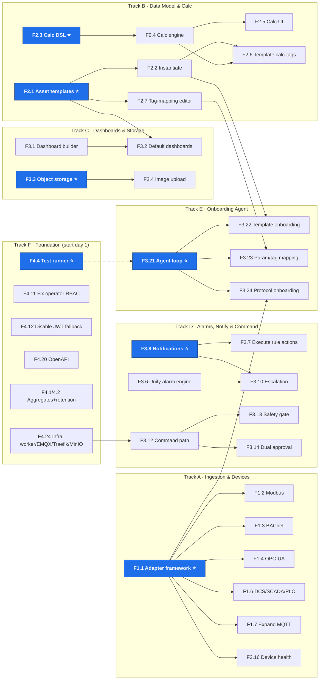

# TRINETRA BMS — Pending-Feature Sequencing & Dependency Map

**Generated:** 2026-07-20
**Purpose:** Turn the flat [pending-features.md](./pending-features.md) list into a
**dependency-ordered plan** — what must be built first, what unblocks the most
downstream work, and what can run **in parallel** across independent teams.
**Companion:** every feature ID below (`F<section>.<n>`) maps to a row in
[pending-features.md](./pending-features.md). For *how* we execute this order
with a one-person team + agents, see
[build-operating-model.md](./build-operating-model.md).

> This document answers one question: *given finite people, in what order and
> with how many parallel tracks do we build the pending features?* It does
> **not** re-argue scope — that lives in `pending-features.md`, and promotion
> still requires an ADR per AGENTS.md §10.

---

## How to read this

- **Enabler** = a feature with **no prerequisites** that **unblocks** others.
  Enablers are the highest-leverage work; start them first.
- **Wave** = a horizontal layer of the dependency graph. Everything in a wave
  can start once the prior wave's blocking items are done. **Items inside a
  wave are parallelizable** unless an intra-wave arrow says otherwise.
- **Track** = an independent, long-running swim-lane (a team can own one
  end-to-end). Tracks mostly progress in parallel; cross-track arrows are the
  few places they must synchronise.
- **`→`** means "blocks / must finish before." **P0–P3** carried from
  `pending-features.md`.

---

## 1. The six parallel tracks (swim-lanes)

Assign one owner (person or pair) per track. They run concurrently; the only
hard hand-offs are the cross-track arrows called out in §3.

| # | Track | Owns | Primary enabler |
|---|-------|------|-----------------|
| **A** | **Ingestion & Devices** | adapter framework, protocol adapters, device health, MQTT expansion | `F1.1` adapter framework |
| **B** | **Data Model & Calc** | asset templates, calc DSL/engine/UI, tag mapping | `F2.1` templates, `F2.3` calc DSL |
| **C** | **Dashboards & Storage** | dashboard builder, object storage, images, reports | `F3.1` dashboard schema, `F3.3` storage |
| **D** | **Alarms, Notify & Command** | unify alarm engine, notifications, escalation, command path | `F3.8` notifications |
| **E** | **Onboarding Agent** | tool-calling agent over locations/templates/assets/params/tags | *(consumes A + B)* |
| **F** | **Platform Foundation** | test runner, RBAC, OpenAPI, Timescale scale, security, infra, observability | `F4.4` test runner |

**Track E has no enabler of its own** — it is the integration layer that
consumes Track A (protocols) and Track B (templates/params). It must start
**last** among the feature tracks, but Track F runs from day one alongside all.

---

## 2. Dependency graph (the hierarchy)

Only the **blocking** edges are drawn; P2/P3 tails are omitted for legibility
(they attach to their track and inherit its ordering).



⭐ = enabler (no prerequisites, unblocks a track).

---

## 3. Wave-by-wave schedule (the order)

### Wave 0 — Enablers & quick wins *(start immediately, all in parallel)*

Nothing here has a prerequisite. These unblock every later wave, so staff them
first. The two **quick security fixes** (`F4.11`, `F4.12`) are hours-to-days and
should be closed before anything builds on the auth surface.

| ID | Feature | Track | P | Why first |
|----|---------|-------|---|-----------|
| **F4.4** | Real test runner (Vitest/Jest) | F | P0 | ⭐ Everything after depends on it for safety; **do this before** any feature code lands |
| **F1.1** | Ingest adapter framework | A | P0 | ⭐ Blocks every protocol adapter + agent protocol onboarding |
| **F2.1** | Asset template schema | B | P0 | ⭐ Blocks instantiation, template calc-tags, default dashboards, agent template onboarding |
| **F2.3** | Calc DSL + definition schema | B | P0 | ⭐ Blocks calc engine/UI, template calc-tags, PUE replacement |
| **F3.8** | Email + webhook notifications | D | P0 | ⭐ Blocks rule-action execution + escalation |
| **F4.1/F4.2** | Continuous aggregates + retention | F | P0 | ⭐ Blocks scalable dashboards + reports |
| **F4.20** | OpenAPI / Swagger | F | P0 | ⭐ Blocks shared contracts package |
| **F4.11** | Fix operator/viewer RBAC | F | P0 | Quick + urgent (zero-asset read scope today) |
| **F4.12** | Disable local-JWT fallback when OIDC set | F | P0 | Quick + urgent auth hardening |
| **F3.3** | Object storage (MinIO/S3) | C | P1 | ⭐ Blocks image upload |
| **F3.6** | Unify alarm engine | D | P0 | Refactor; independent start |
| **F1.8** | Manual time-series entry API+UI | A | P0 | Independent; direct client ask |
| **F1.9** | Telemetry history bulk import | A | P0 | Independent; Excel infra already exists |
| **F4.24** | Infra: worker/EMQX/Traefik/MinIO | F | P2 | Enables cron eval + storage + command downlink |

### Wave 1 — First dependents *(after their Wave-0 enabler lands)*

| ID | Feature | Track | Unblocked by |
|----|---------|-------|--------------|
| **F1.2** Modbus · **F1.3** BACnet · **F1.6** DCS · **F1.7** Expand MQTT · **F1.10** Backpressure | Modbus/BACnet/DCS… | A | `F1.1` |
| **F1.4** OPC-UA · **F1.5** SNMP+REST | A | `F1.1` |
| **F2.2** Instantiate from template | B | `F2.1` |
| **F2.4** Calc execution engine | B | `F2.3` |
| **F3.7** Execute rule actions | D | `F3.8` |
| **F3.10** Escalation profiles | D | `F3.6`+`F3.8` |
| **F3.1** Dashboard schema + builder | C | *(core widgets — no hard dep; start here)* |
| **F3.4** Image upload + linkage | C | `F3.3` |
| **F4.5/F4.7/F4.8/F4.10** Integration/E2E/load/access-control tests | F | `F4.4` |
| **F4.14** Audit read API | F | *(write path exists)* |
| **F4.23** contracts/ui/telemetry-sdk packages | F | `F4.20` |
| **F3.11** Cron rule evaluation (BullMQ) | D | `F4.24` |

### Wave 2 — Second dependents

| ID | Feature | Track | Unblocked by |
|----|---------|-------|--------------|
| **F2.5** Calc config UI | B | `F2.4` |
| **F2.6** Template calc-tags wired | B | `F2.1`+`F2.4` |
| **F2.7** Tag-mapping bulk editor | B | `F2.1` |
| **F2.8** Replace PUE SQL with derived tags | B | `F2.4` |
| **F3.2** Per-asset-type default dashboards | C | `F2.1`+`F3.1` |
| **F3.16** Device health / last-seen | A | ingest (`F1.x`) |
| **F3.21** Onboarding **agent loop** | E | create APIs + `F4.4` |
| **F4.15** Hash-chained audit | F | `F4.14` |
| **F4.6** Contract tests | F | `F4.4`+`F4.23` |

### Wave 3 — Integration layer (Onboarding Agent) & command path

The agent can only be built once templates (B) and adapters (A) exist —
this is the **convergence point** of the whole plan.

| ID | Feature | Track | Unblocked by |
|----|---------|-------|--------------|
| **F3.22** Agent template onboarding | E | `F2.2`+`F3.21` |
| **F3.23** Agent param/tag mapping | E | `F3.21`+`F2.7` |
| **F3.24** Agent protocol onboarding | E | `F3.21`+`F1.1` |
| **F3.25/F3.26/F3.27** Agent UX / grounding / fallback | E | `F3.21` |
| **F3.12** Two-way command path | D | `F4.24` |
| **F3.5** Scheduled PDF/Excel reports | C | `F3.1`+`F4.1` |

### Wave 4 — Depends on Wave-3 + long-tail hardening

| ID | Feature | Track | Unblocked by |
|----|---------|-------|--------------|
| **F3.13** Command safety gate | D | `F3.12` |
| **F3.14** Dual-approval workflow | D | `F3.12` |
| **F4.9** Coverage gates | F | tests exist |
| **F4.27** Kubernetes prod HA | F | infra |
| **F4.16** Row-level security · **F4.17** Rate limiting · **F4.13** MFA · **F4.18** mTLS · **F4.19** compliance | F | independent hardening |
| **F3.9** SMS/push · **F3.17** OTA · **F3.18** X.509 · **F3.19** 3D room · **F3.20** Mobile PWA | A/D | P2/P3 long tail |

---

## 4. Critical path (longest dependency chain)

This chain determines the **minimum calendar time** to a fully agentic
onboarding experience — the headline capability. Shortening it means staffing
these items back-to-back with no gaps:

```
F2.1 templates → F2.2 instantiate → F3.22 agent template onboarding
        (and in parallel)
F2.3 calc DSL → F2.4 calc engine → F2.7 tag-mapping → F3.23 agent param/tag mapping
        (both gated by)
F3.21 agent loop  →  full Onboarding Agent (Wave 3)
```

**Implication:** the Onboarding Agent (Track E) is **schedule-bound by Track B
(templates + calc)**, not by its own difficulty. If the agent is the business
priority, protect Track B from interruption — it is on the critical path and
everything the agent does flows through it.

---

## 5. Parallelization guidance (how many teams)

| Teams available | Recommended allocation |
|-----------------|------------------------|
| **1** | Follow waves strictly top-to-bottom; within a wave do enablers first. Agent lands last. |
| **2** | Team 1 = Track F + Track B (foundation + critical path). Team 2 = Track A then Track D. Merge for Track E (agent) in Wave 3. |
| **3** | T1 = F + B (critical path). T2 = A + C. T3 = D. All converge on E in Wave 3. |
| **4+** | One team per track A–D + a floating Foundation (F) owner; E staffed from B+A once their Wave-2 items clear. |

**Rules of thumb**
1. **Never start feature code before `F4.4` (test runner).** It is the cheapest
   insurance and everything downstream assumes it.
2. **Enablers before breadth:** finish `F1.1` before *any* adapter; finish
   `F2.1`/`F2.3` before *any* template/calc dependent. Resist starting three
   half-built adapters before the framework is solid.
3. **Track F rides alongside, never ahead** of a P0 client feature (same rule as
   `pending-features.md` §Two-benchmarks) — but its *enablers* (`F4.4`, RBAC
   fixes, aggregates, OpenAPI) are Wave 0 because they unblock others.
4. **Track E (agent) is the integration finale** — do not begin `F3.22`–`F3.24`
   until their Track A/B prerequisites are merged, or the agent will be built
   against APIs that don't exist yet.

---

## 6. One-screen summary

```
WAVE 0 (parallel enablers):  F4.4 ⭐  F1.1 ⭐  F2.1 ⭐  F2.3 ⭐  F3.8 ⭐  F4.1/4.2 ⭐  F4.20 ⭐  F3.3 ⭐
                             + quick wins F4.11 F4.12  + F3.6 F1.8 F1.9 F4.24
WAVE 1:  adapters (F1.2/3/4/5/6/7)  F2.2  F2.4  F3.7  F3.10  F3.1  F3.4  tests(F4.5/7/8/10)  F4.14  F4.23  F3.11
WAVE 2:  F2.5  F2.6  F2.7  F2.8  F3.2  F3.16  F3.21 ⭐  F4.15  F4.6
WAVE 3:  Onboarding Agent (F3.22 F3.23 F3.24 F3.25-27)  +  F3.12 command path  +  F3.5 reports
WAVE 4:  F3.13  F3.14  F4.9  F4.27  + security/long-tail (F4.13/16/17/18/19, F3.9/17/18/19/20)
```

> **Reminder:** items here are **candidate scope**. Promoting any into active
> work requires an ADR first (AGENTS.md §10); new deps (Modbus/BACnet libs,
> `bullmq`, `nodemailer`, `minio`, Vitest) are §9.4-gated. When an item is
> promoted, mirror it into `docs/roadmap.md`.
