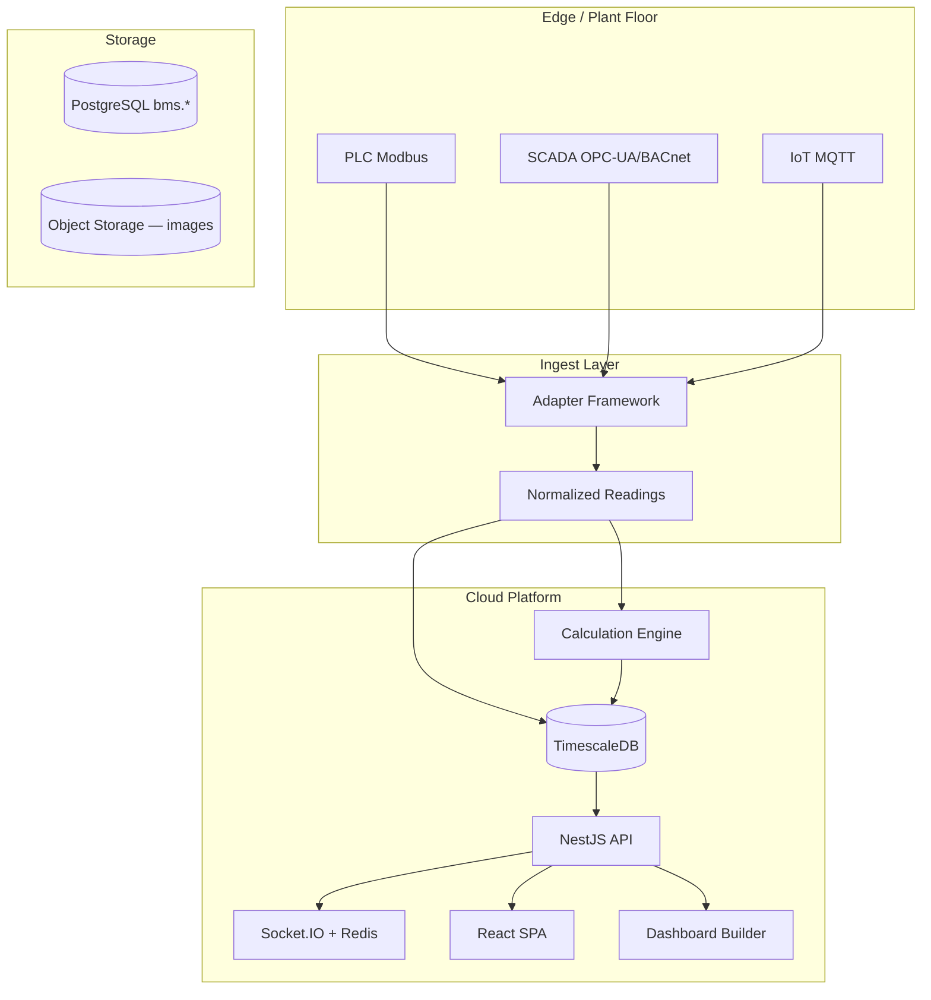
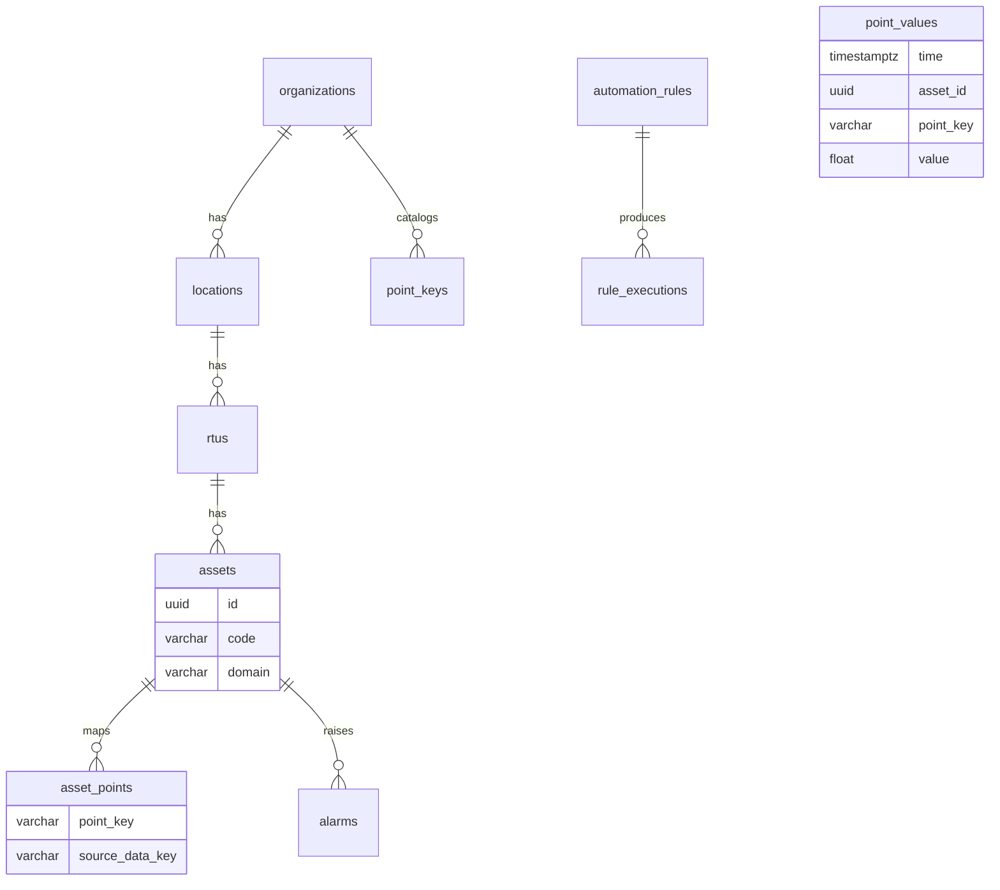

# BMS Platform Assessment — Consolidated Report

**Generated:** 2026-06-27  
**Project:** Eskom SMOC BMS (`portal.BMS/BMS`)  
**Purpose:** Single reference for client requirements, as-is capability, Zoho IoT benchmark, technology stack, gaps, effort, and roadmap.

---

## Document Map

| Document | Format | Contents |
|----------|--------|----------|
| **This file** | Markdown | Consolidated narrative — stack, requirements, gaps, roadmap |
| **platform-assessment-consolidated.docx** | Word | Formatted export (regenerate: `python docs/scripts/build-consolidated-docx.py`) |
| [client-requirements-as-is-report.md](./client-requirements-as-is-report.md) | Markdown | Detailed client as-is analysis with evidence |
| [client-requirements-matrix.csv](./client-requirements-matrix.csv) | CSV | 58 rows — client req × sub-feature × effort |
| [zoho-iot-gap-analysis.md](./zoho-iot-gap-analysis.md) | Markdown | Full Zoho IoT benchmark analysis |
| [zoho-iot-feature-matrix.csv](./zoho-iot-feature-matrix.csv) | CSV | 175 rows — Zoho feature parity matrix |

**Priority rule:** Client requirements take precedence over Zoho IoT parity when roadmaps conflict.

---

## 1. Client Requirements (Source)

1. **Data connect** (SCADA, PLC, DCS, IoT) and rendering to cloud  
2. **Storage:** time-series, images, relational data  
3. **Time-series ingestion:** streaming, manual feed, CSV/Excel upload  
4. **Tags (channels)** on assets (e.g. heat exchanger, cooling tower)  
5. **Asset templates:** assets instantiated from templates; templates define tags (input, output, calculations)  
6. **Tag mapping:** customer tags → system tags  
7. **Calculations:** simple derived (e.g. `C = A + B`), analytics, ML (multivariate time-series), vision  
8. **Dashboards:** configurable charts, widgets, cards  
9. **Calculation setup / configuration**

---

## 2. Existing Technology Stack

### 2.1 Stack overview

| Layer | Technology | Version / notes |
|-------|------------|-----------------|
| Monorepo | pnpm workspaces | 9.15.0 |
| Language | TypeScript | 5.7.x (`strict: true`) |
| Runtime | Node.js | 20 LTS |
| Frontend | React, Vite, Tailwind CSS | 18.3 / 6.x / 3.4 |
| Client state / data | Zustand, TanStack Query, React Router | 5.x / 5.x / 7.x |
| Visualization | ECharts, Leaflet | Charts + world map |
| Backend API | NestJS | 10.4 |
| Validation | Zod | 3.24 |
| ORM / migrations | Drizzle ORM + drizzle-kit | 0.38; raw SQL for Timescale hypertable |
| OLTP database | PostgreSQL | 16 |
| Time-series | TimescaleDB | Same Postgres; 1-day chunks |
| Realtime | Socket.IO + Redis adapter | WS fan-out across API replicas |
| Auth (pilot) | Keycloak OIDC | Realm export in `infra/keycloak/` |
| Auth (dev) | JWT + bcrypt | WSL native dev fallback |
| Logging / metrics | Pino, prom-client | `/metrics` on API, sim, ingest |
| Tracing | OpenTelemetry | Optional API baseline |
| MQTT ingest | MQTT.js | 5.10 — `apps/ingest` |
| Excel onboarding | SheetJS (`xlsx`) | ADR 0013 |
| AI onboarding | OpenAI (optional) + rule fallback | ADR 0011 |
| RTU secrets | AES-256-GCM | ADR 0012 |
| CI/CD | GitHub Actions | Build + migration validation |
| Containers | Docker Compose | Multi-profile pilot deploy |

### 2.2 Applications and packages

| Component | Path | Role |
|-----------|------|------|
| web | `apps/web` | React SPA — dashboards, control room, admin, onboarding |
| api | `apps/api` | NestJS REST + WebSocket |
| sim | `apps/sim` | Synthetic telemetry → TimescaleDB |
| ingest | `apps/ingest` | MQTT TLS subscriber (PHE pilot) |
| @bms/db | `packages/db` | Schema, migrations, seeds |
| @bms/shared | `packages/shared` | Shared types and constants |

### 2.3 Data pipeline

```
[Simulator] ──┐
              ├──► telemetry.point_values (TimescaleDB) ──► pg_notify
[MQTT Ingest] ┘                        │
                                       ▼
                        TelemetryNotifyService → BroadcastHub
                                       │
                        ┌──────────────┼──────────────┐
                        ▼              ▼              ▼
                   Socket.IO      Alarm engine    Rule eval (manual)
                        │
                        ▼
                   React UI
```

### 2.4 Docker Compose services

| Service | Port | Profiles |
|---------|------|----------|
| postgres (TimescaleDB) | 5432 | always |
| redis | 6379 | core, pilot, phe |
| keycloak | 8080 | core, identity, pilot, phe |
| api | 4000 | core, pilot, phe |
| web | 5173 | core, pilot |
| sim | 9101 | sim, pilot |
| ingest | 9102 | ingest, pilot, phe |
| prometheus / loki / grafana | 9090 / 3100 / 3000 | observability |

### 2.5 Key database entities

```
Organization → Location → RTU → Asset → AssetPoint (tag mapping)
                ↓
         point_keys (org system tag catalog)
                ↓
         telemetry.point_values (time, asset_id, point_key, value)
```

### 2.6 Protocol connectivity today

| Protocol | Status |
|----------|--------|
| MQTT TLS | Live (PHE pilot) |
| Simulator | Live |
| Modbus TCP, BACnet, OPC-UA, SNMP, REST poller | Config stored; adapters not wired |
| SCADA / DCS | Not implemented |

---

## 3. Executive Summary

### 3.1 Maturity scores

| Framework | Score | Notes |
|-----------|-------|-------|
| **Client requirements (as-is)** | **38 / 100** | Primary benchmark for delivery |
| Client MVP (after Phase A) | ~55 / 100 | Templates + manual/CSV ingest |
| Client industrial (after Phase B) | ~68 / 100 | Modbus + SCADA adapters |
| Client full vision (Phase C+D) | ~88 / 100 | Calcs, dashboards, ML/vision |
| Zoho IoT AEP parity | 28 / 100 | Secondary benchmark |
| BMS operations depth | 52 / 100 | Control room, work orders, rules |
| Telemetry pipeline | 65 / 100 | Sim + MQTT → Timescale → WS |

### 3.2 Strongest areas (today)

- Relational master-data hierarchy (org → location → RTU → asset → tags)
- Org-scoped system tag catalog (`point_keys`) and per-asset mapping (`asset_points`)
- Admin CRUD + AI/rule-based onboarding wizard with Excel site import
- Streaming telemetry (simulator + MQTT pilot) with live WebSocket dashboards
- Fixed operational dashboards, control-room schematics, energy reporting

### 3.3 Critical gaps (client priority)

| Gap | Client req |
|-----|------------|
| SCADA / PLC / DCS protocol adapters | 1 |
| Asset template engine (I/O/calc tag defs) | 5 |
| Calculation engine + configuration UI | 7, 9 |
| Configurable dashboard builder | 8 |
| Manual / CSV / Excel **telemetry** import | 3 |
| Image / object storage | 2 |
| ML multivariate + vision analytics | 7 |

### 3.4 Effort summary

| Scope | Person-weeks | Calendar (2–3 engineers) |
|-------|--------------|--------------------------|
| Client MVP (Phases A + Modbus + core calcs) | 95–120 | ~8–10 months |
| Full client vision (incl. ML + vision) | 155–200 | ~14–18 months |
| Zoho-class IoT AEP parity (selective) | 175+ | 18+ months |

---

## 4. Client Requirements — As-Is Matrix

| # | Requirement | As-is % | Status | Quality | Gap (pw) | Priority |
|---|-------------|---------|--------|---------|----------|----------|
| 1 | Data connect SCADA/PLC/DCS/IoT → cloud | 25% | Partial | 4/10 | 40–55 | **P0** |
| 2 | TS + images + relational storage | 55% | Partial | 6/10 | 12–18 | **P0** |
| 3 | Streaming / manual / CSV·Excel TS feed | 25% | Partial | 4/10 | 6–10 | **P0** |
| 4 | Tags on assets | 70% | Mostly done | 7/10 | 3–5 | P1 |
| 5 | Asset templates (I/O/calc tags) | 5% | Missing | 1/10 | 10–14 | **P0** |
| 6 | Tag mapping (customer → system) | 72% | Mostly done | 7/10 | 4–6 | P1 |
| 7 | Calculations (derived + ML + vision) | 5% | Missing | 1/10 | 8–64* | P1–P3 |
| 8 | Configurable dashboards | 40% | Partial | 5/10 | 14–18 | **P0** |
| 9 | Calculation setup / config | 0% | Missing | 0/10 | 8–12 | **P0** |

\*8–10 pw simple derived; +20–30 ML; +16–24 vision

**Detail:** See [client-requirements-matrix.csv](./client-requirements-matrix.csv) (58 sub-features).

---

## 5. Zoho IoT Benchmark — Summary

**Benchmark:** [Zoho IoT](https://www.zoho.com/iot/) · [Knowledge Base](https://help.zoho.com/portal/en/kb/iot)

Zoho IoT is a low-code, multi-tenant IoT AEP. The BMS platform is a **domain-specific BMS operations system**, not a generic IoT reseller platform.

### 5.1 Where BMS is stronger

- Eskom SMOC control-room schematics (SLD, CRAC, UPS, HVAC, IT rack) with live SVG telemetry
- Location + asset-group scoped access for utility operations
- Integrated work orders, maintenance schedules, alarm-linked workflows
- Hierarchical master-data admin with onboarding wizard (beyond initial Zoho gap assessment)

### 5.2 Where Zoho is ahead

- Model-driven template propagation (model-once-deploy-many)
- 40+ protocol adapters and edge agents
- OTA firmware, command queue, notification channels
- Self-service dashboard builder (20+ widgets)
- AI anomaly detection, mobile apps, MSP client portals

### 5.3 Zoho maturity by area

| Area | BMS vs Zoho | Score |
|------|-------------|-------|
| Device / gateway lifecycle | Seed + admin CRUD; no OTA | ~20% |
| Protocols | MQTT live; others config-only | ~15% |
| Tag / model system | point_keys + mapping; no asset templates | ~35% |
| Dashboards | Rich fixed UI; not configurable | ~40% |
| Alarms / rules | Implemented; hardcoded + evaluate-only rules | ~45% |
| Notifications | WebSocket only | ~5% |
| Security | Keycloak OIDC + scoped reads | ~40% |

**Detail:** See [zoho-iot-feature-matrix.csv](./zoho-iot-feature-matrix.csv) (175 rows).

---

## 6. What Exists Today (Capability Inventory)

### Implemented

| Capability | Evidence |
|------------|----------|
| Org → Location → RTU → Asset → Point hierarchy | ADR 0008, 0010 |
| System tag catalog per org | `bms.point_keys`, `/admin/point-keys` |
| Customer → system tag mapping | `bms.asset_points`, ingest `source_data_key` → `point_key` |
| Master-data admin CRUD | `apps/api/src/admin/*`, web admin pages |
| Onboarding wizard (AI + rules + Excel) | ADR 0011, 0013; `/admin/.../onboarding` |
| Protocol catalog + encrypted RTU config | Migration 0020, ADR 0012 |
| MQTT TLS ingest (pilot) | `apps/ingest`, ADR 0007 |
| TimescaleDB telemetry | `telemetry.point_values` hypertable |
| Live dashboards + control room | `apps/web` — ECharts, Leaflet, SVG schematics |
| WebSocket live tags | `/ws/telemetry`, `/ws/alarms` |
| Alarms + ack + work orders + rules + maintenance | Phase 5 operations modules |
| Energy CSV export | `/api/v1/reports/energy/export.csv` |
| Keycloak OIDC + location/asset-group RBAC | `AccessControlService`, realm export |

### Partial (does not fully meet client intent)

| Capability | Gap |
|------------|-----|
| Modbus / BACnet / OPC-UA | Config in DB; no runtime adapter |
| Excel / CSV | Master-data onboarding only, not telemetry history |
| Calculations | PUE hardcoded in SQL; no user-defined formulas |
| Dashboards | Fixed screens per route; not operator-configurable |
| Asset creation | Admin/onboarding manual; not template-driven |

### Missing

| Capability |
|------------|
| DCS protocol adapter |
| Image / binary object storage (MinIO/S3) |
| Manual time-series entry API |
| Telemetry bulk import (CSV/Excel) |
| Asset template engine with I/O/calc tag definitions |
| Derived tag calculation engine |
| ML multivariate analytics |
| Vision / image analytics |
| Dashboard builder |
| Calculation configuration UI |
| Email / webhook / SMS notifications |
| Remote command queue |
| OTA firmware |

---

## 7. Unified Roadmap (Client-Priority)

### Phase A — Data Foundation (Weeks 1–14) · ~42 pw

| Deliverable | Req |
|-------------|-----|
| Asset template schema + API | 5 |
| Instantiate assets from template | 5 |
| Telemetry manual entry API + UI | 3 |
| Telemetry CSV bulk import | 3 |
| Tag mapping bulk editor + Excel mapping sheet | 6 |
| Timescale retention + 1m/1h continuous aggregates | 2 |
| Expand MQTT ingest to all enabled RTUs | 1 |
| Device health / last-seen | 1, 4 |

### Phase B — Industrial Connect (Weeks 15–30) · ~48 pw

| Deliverable | Req |
|-------------|-----|
| Ingest adapter framework | 1 |
| Modbus TCP adapter | 1 |
| BACnet/IP read adapter | 1 |
| OPC-UA subscription adapter | 1 |
| DCS connector (client-specific) | 1 |
| Raw message archive + ingest diagnostics | 2 |

### Phase C — Calculations & Dashboards (Weeks 31–46) · ~38 pw

| Deliverable | Req |
|-------------|-----|
| Calculation definition schema (formula DSL) | 7, 9 |
| Calc execution engine (stream + scheduled) | 7, 9 |
| Calc configuration UI | 9 |
| Template calc tags → engine | 5, 9 |
| Dashboard definition schema | 8 |
| Dashboard builder UI (drag-drop subset) | 8 |
| Template default dashboard per asset type | 8 |

### Phase D — Advanced Analytics (Weeks 47–66) · ~44 pw

| Deliverable | Req |
|-------------|-----|
| Object storage (S3/MinIO) + image metadata | 2 |
| Image upload API + asset linkage | 2 |
| ML feature pipeline | 7 |
| Anomaly detection service | 7 |
| Vision inference hook | 7 |
| ML/vision results as calc tags | 7, 9 |

### Cross-cutting (from Zoho gap analysis, aligned to client)

| Item | Phase | Effort |
|------|-------|--------|
| Unified configurable alarm engine | A | 4–6 pw |
| Email + webhook notifications | A | 4–6 pw |
| OpenAPI / Swagger documentation | A | 2–3 pw |
| Audit read API | C | 2–3 pw |
| HA deployment guide (Postgres replica, Redis Sentinel) | C | 8–12 pw |

---

## 8. Target Architecture (Post Phase B+C)



---

## 9. Database — Current and Planned

### Current ER (simplified)



### Planned additions (client-driven)

| Table / object | Purpose |
|----------------|---------|
| `asset_templates` + `template_points` | Req 5 — template tag definitions |
| `calculations` + `calc_inputs` | Req 7, 9 — formula definitions |
| `dashboard_definitions` + `dashboard_widgets` | Req 8 — configurable layouts |
| `telemetry_import_batches` | Req 3 — CSV/Excel upload tracking |
| `asset_images` + object storage bucket | Req 2 — image metadata |
| `device_health` / `last_seen_at` | Req 1, 4 — connection status |
| `telemetry.point_values_1m` (continuous aggregate) | Req 2 — dashboard performance |

---

## 10. Risk Assessment

| Risk | Impact | Mitigation |
|------|--------|------------|
| DCS protocol unknown | Blocks Phase B | Early client protocol workshop |
| Asset templates on critical path | Blocks calcs + dashboards | Start Phase A1 immediately |
| ML/vision scope creep | +36–54 pw | Phase D optional; agree MVP scope |
| Modbus/BACnet field variance | Adapter overrun | One pilot site per protocol |
| Dashboard builder scope | 14–18 pw minimum | MVP: 5 widget types |
| Disk growth (no TS retention) | Production outage | Retention policy in Phase A |
| Operator role zero-asset scope | Unusable demo accounts | Fix RBAC defaults in Phase A |

---

## 11. Prioritized Backlog (Top 25)

| # | Item | Client req | Priority | Effort (pw) | Phase |
|---|------|------------|----------|-------------|-------|
| 1 | Asset template schema + API | 5 | P0 | 10–12 | A |
| 2 | Instantiate assets from template | 5 | P0 | 4–5 | A |
| 3 | Telemetry CSV bulk import | 3 | P0 | 3–4 | A |
| 4 | Manual telemetry entry API + UI | 3 | P0 | 2–3 | A |
| 5 | Modbus TCP ingest adapter | 1 | P0 | 10–12 | B |
| 6 | Ingest adapter framework | 1 | P0 | 4–5 | B |
| 7 | Calculation formula DSL + engine | 7, 9 | P0 | 8–10 | C |
| 8 | Calc configuration UI | 9 | P0 | 4–5 | C |
| 9 | Dashboard builder (core widgets) | 8 | P0 | 14–18 | C |
| 10 | Tag mapping bulk + Excel sheet | 6 | P1 | 4–5 | A |
| 11 | Timescale retention + aggregates | 2 | P0 | 4–5 | A |
| 12 | Expand MQTT to all RTUs | 1 | P0 | 3–4 | A |
| 13 | BACnet read adapter | 1 | P0 | 10–12 | B |
| 14 | OPC-UA adapter | 1 | P1 | 10–14 | B |
| 15 | DCS connector | 1 | P0 | 8–12 | B |
| 16 | Object storage + image API | 2 | P1 | 8–12 | D |
| 17 | Template calc tags | 5, 7 | P0 | 3–4 | C |
| 18 | Template default dashboards | 8 | P1 | 3–4 | C |
| 19 | Unified alarm engine | ops | P0 | 4–6 | A |
| 20 | Email + webhook notifications | ops | P0 | 4–6 | A |
| 21 | OpenAPI documentation | ops | P0 | 2–3 | A |
| 22 | ML anomaly detection | 7 | P2 | 10–12 | D |
| 23 | Vision inference hook | 7 | P3 | 8–10 | D |
| 24 | Audit read API | ops | P1 | 2–3 | C |
| 25 | HA deployment (replica + Sentinel) | 1 | P1 | 8–12 | C |

---

## 12. Final Scores

| Score | Value |
|-------|-------|
| Client requirements — as-is | **38 / 100** |
| Client requirements — MVP (Phase A+B partial+C core) | **~60 / 100** |
| Client requirements — full vision (A+B+C+D) | **~88 / 100** |
| Zoho IoT AEP parity | **28 / 100** |
| Technology stack maturity (for current phase) | **65 / 100** |

---

## 13. Recommended Next Steps

1. **Confirm DCS protocol** with client before Phase B5 sizing.  
2. **Approve Phase A scope** — asset templates and telemetry import are the highest-value, lowest-dependency starting points.  
3. **Agree MVP boundary** — exclude Phase D (ML/vision) from initial contract unless explicitly funded.  
4. **Use CSV matrices** for sprint planning: import [client-requirements-matrix.csv](./client-requirements-matrix.csv) into Jira/Azure DevOps.  
5. **Keep Zoho matrix** as secondary reference for platform features not in client reqs (notifications, OTA, mobile).

---

## References

- Client as-is report: [client-requirements-as-is-report.md](./client-requirements-as-is-report.md)
- Zoho gap analysis: [zoho-iot-gap-analysis.md](./zoho-iot-gap-analysis.md)
- Active project rules: [../AGENTS.md](../AGENTS.md)
- ADRs: `docs/adr/0007` (MQTT pilot), `0010` (master data), `0011` (onboarding), `0012` (credentials), `0013` (Excel)
- Zoho IoT: https://www.zoho.com/iot/
