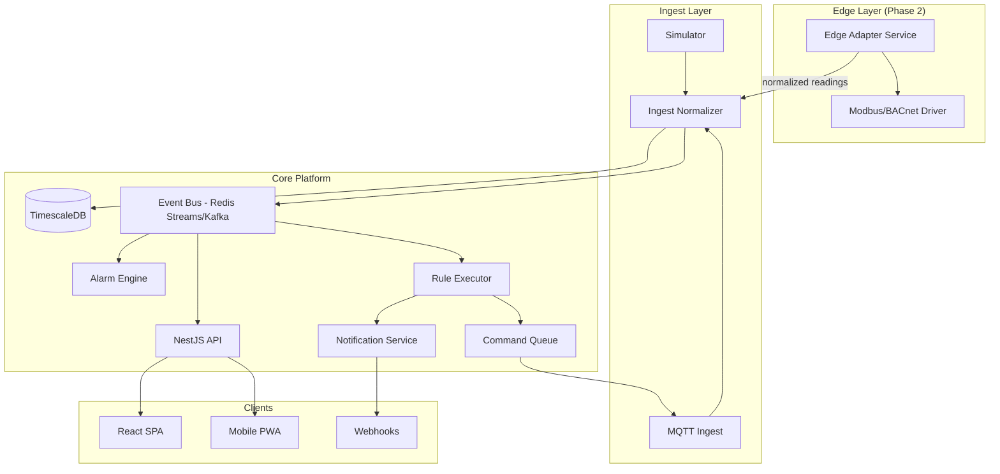
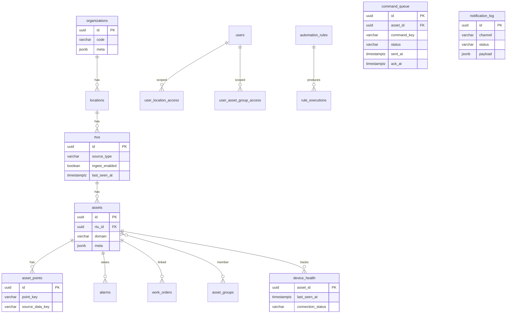

# BMS vs Zoho IoT — Enterprise Feature Gap Analysis

**Generated:** 2026-06-27  
**Benchmark:** [Zoho IoT Platform](https://www.zoho.com/iot/) · [Zoho IoT Knowledge Base](https://help.zoho.com/portal/en/kb/iot) · [REST API Overview](https://www.zoho.com/iot/developer/docs/apis/v1/rest-api-overview.html)  
**Subject:** Eskom SMOC BMS (`portal.BMS/BMS`) — verified from codebase implementation.

**Companion file:** [zoho-iot-feature-matrix.csv](./zoho-iot-feature-matrix.csv)

---

## Methodology

- **Zoho IoT:** Synthesized from official marketing pages, API docs, release notes, partner integration guides (TTN/TTS, Milesight), and partial KB paths. The Help KB portal is largely JavaScript-rendered; not every article body was fetched programmatically.
- **BMS platform:** Audited from schema, services, ingest, sim, API controllers, and UI — not filenames alone.
- **Status legend:** ✅ Exists · ⚠ Partial · ❌ Missing · **Q** = Quality 0–10 · **P** = Priority (Critical/High/Medium/Low)

---

## 1. Executive Summary

### Overall Maturity Score: **28 / 100** (vs Zoho IoT as full IoT AEP)

| Dimension | Score | Rationale |
|-----------|-------|-----------|
| IoT platform breadth | 18/100 | No device onboarding, OTA, edge, multi-protocol, mobile, AI |
| BMS / operations depth | 52/100 | Strong control-room UX, location scoping, work orders, rules UI |
| Telemetry pipeline | 65/100 | Solid sim + pilot MQTT → TimescaleDB → WS; single hypertable |
| Enterprise security | 38/100 | Keycloak OIDC + scoped reads; no MFA, RLS, cert mgmt, audit read API |
| DevOps / scale | 35/100 | Docker Compose + CI + optional Prometheus; no K8s, HA, retention |

### Comparison with Zoho IoT

The BMS system is a **domain-specific BMS demo/pilot**, not a general-purpose IoT Application Enablement Platform (AEP). Zoho IoT is a low-code, multi-tenant AEP with model-driven propagation, 40+ protocols, edge agents, OTA, AI analytics, mobile ops, and native CRM/workflow automation.

**Where BMS is stronger (trade-offs, not "missing"):**

- Eskom SMOC–specific control-room schematics (SLD, CRAC, UPS, HVAC, IT rack) with live SVG telemetry
- Location + asset-group scoped access aligned to utility operations
- Integrated maintenance Kanban + schedule centre + alarm-linked work orders
- Real PHE MQTT pilot path (ADR 0007) without requiring Zoho's model builder

**Where Zoho is categorically ahead:**

- Device/gateway lifecycle APIs, model templates, OTA, command queue
- Notification channels (email, SMS, push, webhooks)
- Edge computing + industrial protocols (Modbus, BACnet, OPC-UA, LoRaWAN)
- Multi-tenant MSP client portals, white-label, data slicing
- AI anomaly detection, predictive maintenance, mobile apps

### Overall Roadmap (Headline)

| Phase | Focus | Duration | Business Value |
|-------|-------|----------|----------------|
| Phase 1 | Device catalog APIs, configurable alarms, notifications, OpenAPI | 8–12 weeks | Operational readiness for pilot expansion |
| Phase 2 | Protocol adapters (Modbus/BACnet edge), command path, retention/aggregates | 12–16 weeks | Real BMS integration |
| Phase 3 | Multi-tenant org RBAC, scheduled rules/reports, audit read API | 10–14 weeks | Enterprise governance |
| Phase 4 | AI analytics, mobile, OTA, MSP portal | 16–24 weeks | Zoho-class platform parity (selective) |

---

## 2. Feature Comparison Summary

See [zoho-iot-feature-matrix.csv](./zoho-iot-feature-matrix.csv) for the full spreadsheet with all rows.

### Platform Architecture

| Zoho Feature | BMS Status | Q | Priority |
|--------------|------------|---|----------|
| Multi-tenant MSP portals | ⚠ Partial (location scoping only) | 3 | High |
| Cloud-native microservices | ⚠ Partial (monolith + sidecar ingest) | 4 | Medium |
| Event-driven architecture | ⚠ Partial (`pg_notify` + Redis WS) | 5 | Medium |
| Plugin / adapter architecture | ❌ Missing | 0 | Critical |
| Redis pub/sub fan-out | ✅ Exists | 7 | — |
| Docker Compose deployment | ✅ Exists | 6 | — |
| Kubernetes / HA | ❌ Missing | 0 | High |
| Message queue (Kafka/Rabbit) | ❌ Missing | 0 | Medium |

**BMS stack:** Monorepo NestJS + React + TimescaleDB + Redis Socket.IO (`apps/api`, `docker-compose.yml`).

### Device Management

| Zoho Feature | BMS Status | Q | Priority |
|--------------|------------|---|----------|
| Device registration API | ❌ Missing (seed-only) | 0 | Critical |
| Provisioning / activation | ❌ Missing | 0 | Critical |
| Bulk import | ⚠ Partial (PHE catalog seed) | 2 | High |
| Device templates / models | ⚠ Partial (static JSON catalog) | 3 | Critical |
| Lifecycle states | ❌ Missing | 0 | High |
| Health / last-seen / heartbeat | ⚠ Partial (freshness heuristics) | 4 | High |
| X.509 certificates | ❌ Missing | 0 | Medium |

**Evidence:** Devices = `bms.assets` seeded via `packages/db/src/seed.ts` and `phe-pilot-seed.ts`. Only read API: `GET /api/v1/assets`.

### Gateway Management

| Zoho Feature | BMS Status | Q | Priority |
|--------------|------------|---|----------|
| Gateway registration API | ⚠ Partial (schema only) | 3 | Critical |
| Edge computing / Edge Agent | ❌ Missing | 0 | High |
| Offline sync / buffering | ❌ Missing | 0 | High |
| Per-gateway MQTT topic binding | ✅ Exists | 6 | — |

**Evidence:** `bms.rtus` (ADR 0008) with `ingest_enabled`, `mqtt_topic`. PHE pilot: one enabled RTU.

### Communication Protocols

| Protocol | Zoho | BMS | Status | Priority |
|----------|------|-----|--------|----------|
| MQTT TLS | ✅ | ✅ | Implemented (pilot) | — |
| HTTP/HTTPS REST | ✅ | ✅ | Implemented | — |
| WebSocket | ✅ | ✅ | Implemented | — |
| Modbus RTU/TCP | ✅ Edge | ❌ | Missing | Critical |
| OPC-UA | ✅ Edge | ❌ | Missing | High |
| BACnet | ✅ | ❌ | Missing | High |
| LoRaWAN | ✅ | ❌ | Missing | Low |

### Telemetry & Time Series

| Zoho Feature | BMS Status | Q | Priority |
|--------------|------------|---|----------|
| Ingestion (MQTT + sim) | ✅ Exists | 7 | — |
| Historical query API | ✅ Exists | 6 | — |
| Retention policies | ❌ Missing | 0 | High |
| Continuous aggregates | ❌ Missing | 0 | High |
| Timescale hypertable | ✅ Exists | 7 | — |

**Evidence:** `telemetry.point_values` hypertable in `0000_sprint1_foundation.sql`; dashboard index in `0011_telemetry_dashboard_indexes.sql`.

### Dashboards

| Zoho Feature | BMS Status | Q | Priority |
|--------------|------------|---|----------|
| Drag-drop builder | ❌ Missing | 0 | Medium |
| KPI cards / charts / maps | ✅ Exists | 7 | — |
| Live widgets (WebSocket) | ✅ Exists | 7 | — |
| Control-room schematics (SVG) | ✅ Exists | 8 | — |
| Public URL sharing | ❌ Missing | 0 | Low |

### Alarms & Rules

| Zoho Feature | BMS Status | Q | Priority |
|--------------|------------|---|----------|
| Configurable alarm rules (UI) | ⚠ Partial | 4 | Critical |
| Acknowledgement | ✅ Exists | 7 | — |
| Escalation | ❌ Missing | 0 | High |
| Auto-clear on normal | ❌ Missing | 0 | High |
| IF/THEN threshold rules | ✅ Exists | 6 | — |
| Visual rule builder | ✅ Exists | 7 | — |
| Action execution (notify/command) | ⚠ Partial (stored, not executed) | 2 | Critical |
| Scheduled/cron evaluation | ❌ Missing | 0 | High |

**Critical gap:** `AlarmThresholdService` has hardcoded rules separate from the configurable rule engine in `apps/api/src/alarms/alarm-threshold.service.ts`.

### Notifications & Commands

| Channel / Feature | BMS Status | Priority |
|-------------------|------------|----------|
| Email | ❌ Missing | Critical |
| Webhooks | ❌ Missing | High |
| SMS / Push | ❌ Missing | Medium |
| In-app (WebSocket only) | ⚠ Partial | — |
| Command queue | ❌ Missing | Critical |
| MQTT downlink | ❌ Missing | Critical |

Explicitly deferred per `AGENTS.md` §6.

### Security

| Zoho Feature | BMS Status | Q | Priority |
|--------------|------------|---|----------|
| RBAC | ✅ Exists | 6 | — |
| OIDC (Keycloak) | ✅ Exists | 7 | — |
| MFA | ❌ Missing | 0 | High |
| Audit log (write) | ✅ Exists | 5 | — |
| Audit log (read API) | ❌ Missing | 0 | High |
| Row-level security | ❌ Missing | 0 | Medium |

**Issue:** `operator` and `viewer` roles resolve to `kind: "none"` with zero assets unless DB access rows exist (`apps/api/src/auth/access-control.service.ts`).

---

## 3. Missing Features by Priority

### Critical (blocks pilot → production IoT)

| Feature | Gap | Effort (pw) |
|---------|-----|-------------|
| Device/asset CRUD + onboarding API | Seed-only today | 4–6 |
| Configurable alarm engine (unify with rules) | Hardcoded thresholds | 4–6 |
| Notification channel (email + webhook minimum) | WebSocket-only | 4–6 |
| Protocol adapter framework | No Modbus/BACnet path | 10–14 |
| Command path (queue + MQTT downlink) | Explicitly deferred | 8–10 |
| OpenAPI documentation | No public contract | 2–3 |

### High

| Feature | Effort (pw) |
|---------|-------------|
| RTU/gateway management API | 4–5 |
| Timescale retention + continuous aggregates | 4–6 |
| Scheduled rule evaluation + report scheduling | 6–8 |
| Device health / last-seen tracking | 3–4 |
| Audit read API | 2–3 |
| User admin API | 4–6 |
| Alarm escalation + auto-clear | 4–6 |

### Medium

| Feature | Effort (pw) |
|---------|-------------|
| Device model/template runtime engine | 8–10 |
| Self-service dashboard builder | 12–16 |
| PDF/Excel reports | 4–6 |
| Multi-org RBAC (beyond location scoping) | 6–8 |
| API rate limiting + service accounts | 3–4 |

### Low

| Feature | Effort (pw) |
|---------|-------------|
| OTA firmware | 10+ |
| Mobile apps | 16+ |
| AI anomaly detection | 10+ |
| Geofencing | 8–10 |
| MSP white-label client portals | 12+ |
| LoRaWAN data streams | 8–12 |

---

## 4. Phased Implementation Roadmap

### Phase 1 — Pilot Hardening (Weeks 1–12) · ~35 person-weeks

**Goal:** Expand PHE pilot safely; operators get configurable alarms and outbound notifications.

1. Device/asset/RTU CRUD APIs with Zod validation
2. Unify `AlarmThresholdService` into DB-driven rules; wire rule `notify` actions
3. Email + webhook notification service
4. OpenAPI/Swagger for all `/api/v1` routes
5. Device last-seen + connection status on location dashboard
6. Timescale retention policy (90-day hot, configurable)
7. Automated access-control integration tests

### Phase 2 — BMS Integration (Weeks 13–28) · ~45 person-weeks

**Goal:** Real building protocols and bidirectional control.

1. Edge adapter service (Modbus TCP/RTU) → same ingest pipeline
2. Command queue table + MQTT publish path
3. BACnet read-only adapter (pilot scope)
4. Continuous aggregates (`point_values_1m`, `_1h`)
5. Scheduled rules + maintenance schedule auto-evaluation
6. Raw message archive table (debugging)
7. Expand MQTT ingest to all PHE RTUs (feature-flagged)

### Phase 3 — Enterprise Governance (Weeks 29–42) · ~35 person-weeks

**Goal:** Multi-site operations at Eskom scale.

1. Org-level RBAC + data slicing
2. Audit read API + export
3. Scheduled PDF/Excel energy reports
4. Alarm escalation profiles + maintenance mode suppression
5. User admin UI + Keycloak sync
6. HA deployment guide (Postgres replica, Redis Sentinel, API replicas)
7. Backup/restore automation

### Phase 4 — Platform Parity (Weeks 43–66) · ~60+ person-weeks

**Goal:** Close gap with Zoho-class IoT AEP (selective).

1. Device model template engine (model-once-deploy-many)
2. Dashboard widget builder (subset of Zoho's 20+ widgets)
3. AI anomaly detection on key electrical/HVAC points
4. Mobile PWA or React Native ops app
5. OTA firmware module (if hardware supports)
6. Optional MSP multi-tenant portal

---

## 5. Architecture Improvements



| Issue | Recommendation |
|-------|----------------|
| Monolithic API does ingest fan-out + alarms + rules | Extract alarm evaluator and rule executor as workers consuming Redis Streams |
| `pg_notify` is fire-and-forget, 7KB limit | Keep for low-latency WS; add durable queue for alarm/rule side effects |
| Hardcoded alarm rules | Single AlarmRuleEngine reading from `automation_rules` where `category = 'alarm'` |
| No adapter plugin pattern | Define `IngestAdapter` interface; register MQTT, Modbus, Sim adapters |
| Ingest app is standalone JS | Promote to NestJS microservice or shared `@bms/ingest` package |
| Operator/viewer roles broken by default | Seed default location access or map roles to read-only global scope |

---

## 6. Database Improvements



### Recommended schema additions

| Table / Change | Purpose |
|----------------|---------|
| `bms.device_models` + `device_model_points` | Runtime template engine |
| `bms.device_health` or columns on `rtus`/`assets` | `last_seen_at`, `connection_status` |
| `bms.command_queue` | Remote command lifecycle |
| `bms.notification_profiles` + `notification_log` | Email/webhook delivery |
| `bms.raw_messages` (TTL) | Debug ingest like Zoho raw storage |
| `telemetry.point_values_1m` (continuous aggregate) | Dashboard performance |
| Index on `alarms(asset_id, rule_key) WHERE acknowledged_at IS NULL` | Dedup performance |
| Index on `rtus(ingest_enabled, source_type)` | Ingest mapping reload |
| Retention policy on `point_values` | Cost control at scale |
| `assets.parent_asset_id` | Asset hierarchy (optional) |

---

## 7. API Improvements

| Gap | Recommendation |
|-----|----------------|
| No OpenAPI | Add `@nestjs/swagger`; publish at `/api/docs` |
| No pagination on assets | Cursor pagination like alarms |
| No device provisioning | `POST /api/v1/devices` with model template ref |
| No gateway API | `CRUD /api/v1/rtus` with `ingest_enabled` toggle |
| No webhook subscriptions | `POST /api/v1/webhooks` for alarm/rule events |
| No aggregation endpoint | `GET /api/v1/telemetry/aggregate?fn=avg&bucket=1h` |
| Inconsistent error shape | Standard `{ error, code, details }` envelope |
| No rate limiting | `@nestjs/throttler` or API gateway |
| No service account tokens | OAuth client credentials via Keycloak |

### Priority new endpoints

```
POST   /api/v1/rtus
POST   /api/v1/assets
POST   /api/v1/assets/:id/points
GET    /api/v1/assets/:id/health
POST   /api/v1/commands
GET    /api/v1/commands/:id
GET    /api/v1/audit-log
POST   /api/v1/notifications/test
GET    /api/v1/telemetry/aggregate
```

---

## 8. UI/UX Improvements

| Area | Current | Recommendation |
|------|---------|----------------|
| Device onboarding | None | Wizard: select model → map points → enable ingest |
| Alarm config | Split (hardcoded + rules page) | Single Alarm Centre with rule-linked config |
| Gateway status | Hidden in location detail | RTU health cards with last-seen, message rate |
| Dashboards | Fixed routes | User-pinned KPI layouts (Phase 3) |
| Data Explorer | None | Per-asset multi-point time-series debug pane |
| Mobile | Desktop-only | Responsive PWA with push for critical alarms |
| Command UX | Disabled buttons | Enable with confirmation modal when backend ready |

### Wireframe — Device Onboarding Wizard

```
┌─────────────────────────────────────────────────────────┐
│  Add Device                                    Step 2/4  │
├─────────────────────────────────────────────────────────┤
│  Location: [Bhutnirghat I ▼]   RTU: [EdgeRTU-13 ▼]     │
│                                                          │
│  Model: [MFM-3Phase ▼]     Device Code: [PHE-MFM-001]  │
│                                                          │
│  Point Mapping Preview:                                  │
│  ┌──────────────┬─────────────┬──────────┐              │
│  │ Source Key   │ BMS Point   │ Unit     │              │
│  │ TKW          │ kw          │ kW       │              │
│  │ APV          │ voltage_l1_v│ V        │              │
│  └──────────────┴─────────────┴──────────┘              │
│                                                          │
│  [ ] Enable live MQTT ingest                             │
│                                                          │
│              [Back]              [Create & Enable →]     │
└─────────────────────────────────────────────────────────┘
```

---

## 9. Security Improvements

| Risk | Severity | Fix |
|------|----------|-----|
| Operator/viewer get zero assets by default | High | Default read scope or seed access rows |
| JWT fallback in production | High | Disable local JWT when `OIDC_ISSUER` set |
| No API rate limiting | Medium | Throttle auth + telemetry endpoints |
| Audit log write-only | Medium | Read API with admin role |
| No RLS on Postgres | Medium | Application-level scoping OK for pilot; add RLS Phase 3 |
| Ingest silently drops bad JSON | Low | Metrics counter + dead-letter log |
| No MFA | Medium | Enable Keycloak MFA for pilot realm |

---

## 10. Scalability Improvements (Millions of Devices)

| Bottleneck | Current | Target |
|------------|---------|--------|
| Single hypertable, no aggregates | All queries hit raw `point_values` | Continuous aggregates + tiered retention |
| `pg_notify` 7KB chunks | Works for demo scale | Redis Streams or Kafka for ingest fan-out |
| Ingest mapping loaded once at startup | Stale on DB changes | Periodic reload or LISTEN on config changes |
| API asset scoping loads all IDs | `readableAssetIds()` full list | Cache scope in Redis with TTL |
| Single Postgres | No replica | Read replica for dashboards/reports |
| WebSocket per API instance | Redis adapter ✅ | Already supports horizontal API scale |

**Scale reference:** 10K devices × 10 points × 1/min ≈ 144M rows/day — requires aggregates, retention, and partitioned ingest workers before millions of devices.

---

## 11. Code Review Findings

### Duplicated Logic

- Two alarm paths: `AlarmThresholdService` (hardcoded) vs `RulesService` (configurable, evaluate-only) — should be one engine.
- Point key constants duplicated across sim, shared, rules catalog — acceptable but needs single catalog service.

### Technical Debt

- Ingest is untyped JS while API is strict TS — testability gap.
- `docs/AGENTS.production.md` describes continuous aggregates not yet migrated.
- ADR 0007 references `bms.ingestion_gateways` but ADR 0008 migrated to `bms.rtus` — doc drift.
- Phase 5 Sprint J/K/L/M/N hardening checklist in `docs/roadmap.md` still open.

### Architecture Smells

- Rules store `action: { type: "notify" }` but never execute — misleading UX.
- `resolveDbUser` creates synthetic user from JWT if not in DB — OIDC users may lack scope rows.
- No idempotency on telemetry upserts at ingest (depends on PK `(time, asset_id, point_key)`).

### SQL / Index Gaps

- Missing partial index on open alarms for dedup hot path.
- No retention policy — disk growth unbounded.

---

## 12. Risk Assessment

| Risk | Likelihood | Impact | Mitigation |
|------|------------|--------|------------|
| Pilot MQTT broker dependency (ThinkIoT) | Medium | High | Abstract broker config; add EMQX when promoted |
| Hardcoded alarms miss real faults | High | High | Phase 1 unified alarm engine |
| Disk fill (no retention) | High | Medium | Timescale retention policy in Phase 1 |
| Operator role unusable | High | Medium | Fix default scoping + seed |
| Scope creep toward full Zoho parity | Medium | High | Stay BMS-focused; defer MSP/AI/mobile |
| Single ingest worker SPOF | Medium | High | Multiple ingest replicas + shared mapping |
| No command path blocks BMS control use cases | High | High | Phase 2 command queue |

---

## 13. Prioritized Backlog (Top 20)

| # | Item | Priority | Effort (pw) | Phase |
|---|------|----------|-------------|-------|
| 1 | Unified configurable alarm engine | Critical | 5 | 1 |
| 2 | Email + webhook notifications | Critical | 4 | 1 |
| 3 | Asset/RTU CRUD APIs | Critical | 6 | 1 |
| 4 | OpenAPI documentation | Critical | 2 | 1 |
| 5 | Device last-seen / health | High | 3 | 1 |
| 6 | Timescale retention policy | High | 2 | 1 |
| 7 | Fix operator/viewer RBAC | High | 2 | 1 |
| 8 | Access control integration tests | High | 3 | 1 |
| 9 | Continuous aggregates (1m/1h) | High | 5 | 2 |
| 10 | Modbus TCP edge adapter | Critical | 10 | 2 |
| 11 | Command queue + MQTT downlink | Critical | 8 | 2 |
| 12 | Scheduled rule evaluation | High | 4 | 2 |
| 13 | Raw message debug store | Medium | 3 | 2 |
| 14 | Audit read API | High | 2 | 3 |
| 15 | User admin API + UI | High | 5 | 3 |
| 16 | Alarm escalation profiles | High | 4 | 3 |
| 17 | Scheduled PDF reports | Medium | 4 | 3 |
| 18 | Device model template engine | Medium | 10 | 4 |
| 19 | Dashboard widget builder | Medium | 12 | 4 |
| 20 | AI anomaly detection (pilot points) | Medium | 10 | 4 |

**Total estimated effort to Phase 3 enterprise readiness:** ~115 person-weeks  
**Total to Phase 4 Zoho-class parity (selective):** ~175 person-weeks

---

## 14. Final Enterprise Maturity Score

| Framework | Score |
|-----------|-------|
| vs Zoho IoT (full AEP) | **28 / 100** |
| vs Eskom BMS operational needs (current phase) | **52 / 100** |
| Telemetry pipeline maturity | **65 / 100** |
| Security & governance | **38 / 100** |
| Integration & developer experience | **32 / 100** |

### Score Interpretation

The BMS platform is a **strong BMS operations prototype** with a working telemetry pipeline and domain-specific control-room UX. Against Zoho IoT as a commercial IoT AEP, it covers roughly **25–30% of platform capabilities** — concentrated in dashboards, location scoping, basic rules, work orders, and a single MQTT ingest path.

**Highest business-value next steps:** Phase 1 (configurable alarms, notifications, device APIs, retention) unlocks pilot expansion without attempting full Zoho parity. Full parity on edge protocols, OTA, AI, and mobile would require a multi-year platform investment — likely unnecessary if the north star remains **Eskom SMOC BMS** rather than a generic IoT reseller platform.

---

## References

- Zoho IoT Platform: https://www.zoho.com/iot/
- Zoho IoT Knowledge Base: https://help.zoho.com/portal/en/kb/iot
- Zoho IoT REST API: https://www.zoho.com/iot/developer/docs/apis/v1/rest-api-overview.html
- BMS ADR 0007 (PHE MQTT pilot): `docs/adr/0007-phe-mqtt-ingest-pilot.md`
- BMS ADR 0008 (Org/Location/RTU hierarchy): `docs/adr/0008-org-location-rtu-hierarchy.md`
- BMS active rules: `AGENTS.md`
